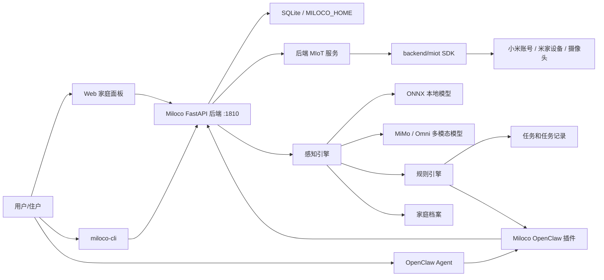
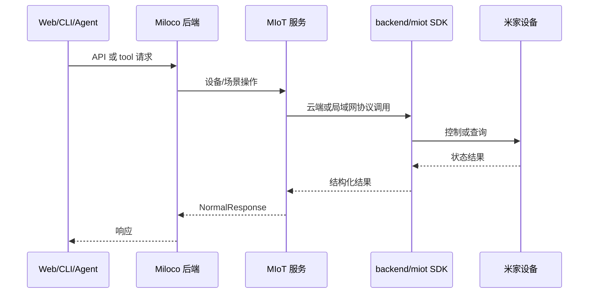

# 系统架构

## 一句话

Miloco 是运行在 OpenClaw 生态中的全屋智能感知和自动化系统。后端负责感知、设备、规则、任务和数据持久化；Web、CLI、OpenClaw 插件都是围绕同一后端能力的操作面。

## 总体关系

## 运行面

| 操作面 | 使用者 | 入口 | 说明 |
| --- | --- | --- | --- |
| Web | 住户和调试者 | `http://<host>:1810/` | 后端同端口提供 SPA，页面从 HTML 注入 token。 |
| CLI | 运维和自动化脚本 | `miloco-cli` | 管服务、账号、设备、配置、诊断、身份、规则、任务。 |
| OpenClaw 插件 | Agent | `plugins/openclaw` | 注册 hook、service、webhook、tool，把 Agent 行为接入后端。 |
| 后端 HTTP API | Web/CLI/插件 | FastAPI routers | 统一鉴权、路由和业务编排。 |

## 后端边界

后端是单实例家用 daemon，不按 uvicorn worker 横向扩展。原因是感知引擎、watchdog、资源监控、配置缓存和 SQLite 持久化都按单进程设计。需要横向能力时，应在反向代理层做多上游，而不是给 uvicorn 加 workers。

后端永远以 HTTP 启动。跨网访问要在反代层做 TLS 和额外认证。默认 `host=127.0.0.1` 只给本机使用；如果改成 `0.0.0.0` 暴露局域网，要把局域网视作信任边界。

## 数据和控制链路

### 设备控制链路

### 感知链路

摄像头和音频输入进入后端感知管线，典型分层是采集、Gate、Identity、Omni。Gate 用于减少无意义下游调用，Identity 负责跟踪和成员识别，Omni 负责多模态场景理解。结果沉淀为感知日志、有价值事件、规则触发上下文、家庭档案候选和任务记录线索。

关键源码：

- 采集：`backend/miloco/src/miloco/perception/collect`
- 编排：`backend/miloco/src/miloco/perception/engine/api.py`
- 管线：`backend/miloco/src/miloco/perception/engine/pipeline.py`
- 处理器：`backend/miloco/src/miloco/perception/processor.py`
- 身份：`backend/miloco/src/miloco/perception/engine/identity`
- Omni：`backend/miloco/src/miloco/perception/engine/omni`

### Agent 链路

OpenClaw 插件把 Miloco 能力注册给 Agent。常见路径是 Agent 触发插件 tool 或 webhook，插件读取配置并调用后端；后端也可以通过插件 webhook 反向获取 Agent turn 元数据或发送消息。

关键源码：

- 插件入口：`plugins/openclaw/src/index.ts`
- HTTP route：`plugins/openclaw/src/webhooks/index.ts`
- Prompt 和 trace hook：`plugins/openclaw/src/hooks`
- Miloco 配置桥接：`plugins/openclaw/src/miloco/config.ts`

## 持久化

主要持久化由 `$MILOCO_HOME` 承载，默认是 `~/.openclaw/miloco`。配置文件是 `$MILOCO_HOME/config.json`，SQLite 和日志也在该 home 下派生。配置默认值来自 `backend/miloco/src/miloco/config/settings.yaml`，加载和环境变量覆盖逻辑在 `settings.py`。

仓储层集中在 `backend/miloco/src/miloco/database`。任务、规则、家庭档案、感知日志、token 用量和有价值事件都通过 repo 或 DAO 进入 SQLite。

## 与仓库内 knowledge 的关系

源码仓库自带 `knowledge/`，它更像项目内知识库和设计文档。本 Obsidian 库只沉淀个人后续部署、测试、排障和二次开发方法论。需要事实复核时，优先回到源码和 `knowledge/`。
