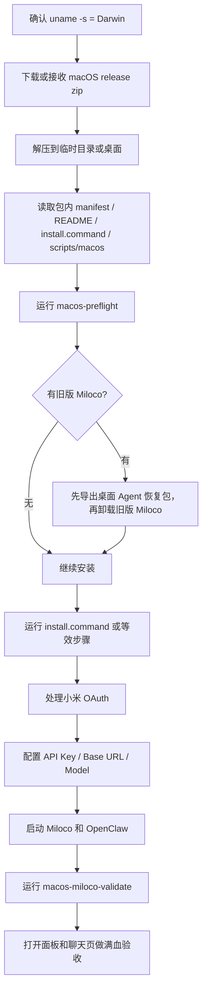

# macOS 部署教程：Agent 一键版

适用场景：目标机器是 macOS，用户希望 Agent 自动下载 easy-miloco macOS 一键包、运行安装器、处理授权和模型配置、完成验收。

本文是 [../install-guide.md](../install-guide.md) 路由后的 macOS 子指南。Agent 从 README 的一句话进入总入口后，如果目标系统是 macOS，只读本文继续执行。

## 前置条件

- 目标系统必须是 macOS：`uname -s` 返回 `Darwin`。
- 支持架构：`arm64` 或 `x86_64`。
- 绝对不要使用 WSL。
- Agent 可以在本机执行 shell 命令，并可打开浏览器或指导用户复制小米 OAuth payload。
- 小米账号和模型 API Key / Base URL 可以后置；缺失时只能交付基础安装，不能宣称满血完成。

## Agent 输入清单

最少需要：

- 目标机器就是当前 macOS，或可通过 SSH 登录到该 Mac。
- 如需代理，提供代理地址，例如 `http://127.0.0.1:7897`。
- 用户是否已经下载了 easy-miloco macOS release zip；如果有，提供本地路径。

满血阶段还需要：

- 小米 OAuth payload：授权成功页面显示的授权码，或报错页地址栏完整 URL。
- 模型配置：
  - API Key
  - Base URL，必须是 OpenAI 兼容格式，通常以 `/v1` 结尾
  - Model，例如 `mimo-v2.5`
- 如果有多个家庭或多个摄像头，需要用户确认目标家庭和摄像头范围。

## 给 Agent 的一键指令模板

```text
请在这台 macOS 上部署 Xiaomi Miloco：

- 系统：macOS
- 如需代理：<例如 http://127.0.0.1:7897，没有就写无>
- 如果我已经下载 release zip：<本地 zip 路径，没有就写无>

要求：
1. 先读取 https://raw.githubusercontent.com/andy-JustSayWhen/easy-miloco/macOS/docs/install-guide.md，根据系统路由到 macOS 子指南。
2. 绝对不要使用 WSL。
3. 自动下载或使用我提供的 macOS release zip，解压后先读 manifest.json、README.md、install.command、scripts/macos/*.sh。
4. 优先运行 ./install.command；如果当前环境不适合交互式窗口，按 install.command 和 scripts/macos/*.sh 的逻辑执行同等步骤。
5. 安装期间遇到小米账号授权时，自动打开浏览器；用户授权后，既接受授权码，也接受报错页地址栏完整 URL。
6. 配置模型时必须收集 API Key、Base URL、Model，不要只收 Key。
7. 安装完成后运行 macos-miloco-validate.sh，报告 BASIC_READY / FULL_READY。
8. 最终必须打开 Miloco 面板和 OpenClaw 聊天页，确认 OpenClaw 自动登录，并询问“家里有几个摄像头？画面如何？”。
9. 如失败，先读取 /tmp/easy-miloco*.log、~/.openclaw/miloco/log/、/tmp/openclaw/，不要盲目重装。
```

## 执行流程



## 获取 Release

如果用户没有提供本地 zip，读取：

```text
https://api.github.com/repos/andy-JustSayWhen/easy-miloco/releases/latest
```

按当前架构下载：

```bash
arch="$(uname -m)"
case "$arch" in
  arm64) pattern='easy-miloco-*-macos-arm64.zip' ;;
  x86_64) pattern='easy-miloco-*-macos-x86_64.zip' ;;
  *) echo "unsupported arch: $arch"; exit 2 ;;
esac
```

如果 release 暂时没有 macOS asset，停止并让用户提供本地 macOS zip，不要改走 Windows 包或 WSL。

## 解压后先读包内代码

拿到 zip 后：

```bash
mkdir -p "$HOME/Desktop/easy-miloco-agent-install"
ditto -x -k "<release.zip>" "$HOME/Desktop/easy-miloco-agent-install"
cd "$HOME/Desktop/easy-miloco-agent-install"/easy-miloco-*-macos-*
```

必须先读：

```text
manifest.json
README.md
install.command
scripts/macos/macos-preflight.sh
scripts/macos/macos-miloco-validate.sh
scripts/macos/macos-post-auth-finish.sh
```

确认包内有当前架构 payload：

```bash
bash scripts/macos/macos-preflight.sh --package-root . --miloco-port 1810 --openclaw-port 18789
```

## 运行安装器

优先在 release 解压目录运行：

```bash
chmod +x install.command
./install.command
```

如果 macOS quarantine 阻止执行：

```bash
xattr -dr com.apple.quarantine .
chmod +x install.command scripts/macos/*.sh payload/install.sh
./install.command
```

如果 Agent 运行环境不能交互式操作窗口，应按 `install.command` 的顺序执行，不要跳过步骤：

1. `macos-preflight.sh`
2. 如检测到旧版，先导出桌面 Agent 恢复包，再卸载旧版
3. 确保 OpenClaw CLI 可用
4. 准备本地 payload cache
5. 运行 `payload/install.sh`
6. 启动 `miloco-cli service`
7. 启动 `openclaw gateway`
8. 创建桌面入口
9. 运行 `macos-miloco-validate.sh`

## 授权和模型配置

小米账号：

- 安装器或 Agent 应打开小米授权链接。
- 用户可能拿到两种结果：
  - 页面直接显示授权码
  - 页面报错，但地址栏包含完整回调 URL
- 两者都应作为 payload 传给收尾脚本或安装器，不要要求用户只复制某一种格式。

模型配置：

- 必须收集 `API Key`、`Base URL`、`Model`。
- 不要只配置 Key。
- 不要给 Base URL 预填固定值让用户删除；让用户明确粘贴。
- 如果用户没有 Key，引导用户去对应模型平台获取，不要编造不可验证的供应商清单。

拿到授权和模型信息后，可以用包内脚本收尾：

```bash
MILOCO_AUTH_PAYLOAD='<授权码或完整回调 URL>' \
MIMO_API_KEY='<API Key>' \
OMNI_BASE_URL='<Base URL>' \
OMNI_MODEL='<Model>' \
bash scripts/macos/macos-post-auth-finish.sh --miloco-port 1810 --openclaw-port 18789
```

只生成授权链接：

```bash
bash scripts/macos/macos-post-auth-finish.sh --print-bind-url
```

只应用授权：

```bash
MILOCO_AUTH_PAYLOAD='<授权码或完整回调 URL>' \
bash scripts/macos/macos-post-auth-finish.sh --authorize-only
```

## 验收

基础验收：

```bash
bash scripts/macos/macos-miloco-validate.sh --miloco-port 1810 --openclaw-port 18789
```

满血验收：

```bash
bash scripts/macos/macos-miloco-validate.sh --strict-full --miloco-port 1810 --openclaw-port 18789
```

还必须人工或通过浏览器自动化确认：

- Miloco 面板可打开：`http://127.0.0.1:1810/`
- Miloco 面板概述页能看到摄像头数量。
- 桌面存在 `米Miloco控制台.command` 和 `OpenClaw 对话.command`。
- OpenClaw 聊天页由桌面入口或 token URL 打开后自动登录。
- 在 OpenClaw 聊天中询问：

```text
家里有几个摄像头？画面如何？
```

交付时报告：

```text
Miloco URL
OpenClaw URL
BASIC_READY
FULL_READY
账号绑定状态
模型配置状态
设备列表状态
摄像头 scope 状态
桌面入口路径
关键日志路径
```

## 日志位置

优先读取：

```text
/tmp/easy-miloco-macos-validation.log
/tmp/easy-miloco-macos-service-start.log
/tmp/easy-miloco-macos-service-restart.log
/tmp/easy-miloco-macos-openclaw-*.log
~/.openclaw/miloco/log/
/tmp/openclaw/
~/Desktop/OpenClaw 登录信息.txt
```

如果用户手动双击安装器，终端窗口前台输出也是证据；不要只看退出码。

## 自动修复策略

| 现象 | Agent 处理 |
| --- | --- |
| `install.command` 被阻止 | `xattr -dr com.apple.quarantine .` 后重试 |
| 缺少 `uv` | 让安装器自动安装；失败再读日志定位网络或权限 |
| 缺少 OpenClaw | 优先用包内安装器逻辑安装 npm OpenClaw；失败再走官方 installer |
| 1810 或 18789 被占用 | 查 `lsof -nP -iTCP:<port> -sTCP:LISTEN`，确认是否旧 Miloco/OpenClaw；不要随意杀无关进程 |
| `BASIC_READY=yes` 但 `FULL_READY=no` | 继续补账号、模型、设备、摄像头 scope，不要判定安装失败 |
| OpenClaw 打开登录页 | 读取 `~/Desktop/OpenClaw 登录信息.txt`，用推荐 token URL 或桌面 `OpenClaw 对话.command` 重新打开 |
| 面板有摄像头但 OpenClaw 说看不到画面 | 按摄像头六层模型定位，不要直接重装 |

## 禁止事项

- 不要在 macOS 上安装或启用 WSL。
- 不要把 Windows release 包当 macOS 包用。
- 不要跳过包内 preflight 和 validate。
- 不要因为 `FULL_READY=no` 就重装。
- 不要清理用户的 OpenClaw 聊天历史；只要确认 release 包没有打进本机 `.openclaw` 状态。
- 不要在用户未确认的情况下删除 Agent 恢复包。
