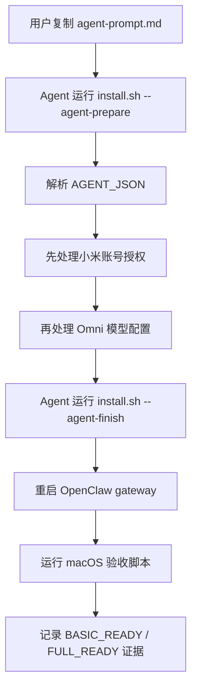
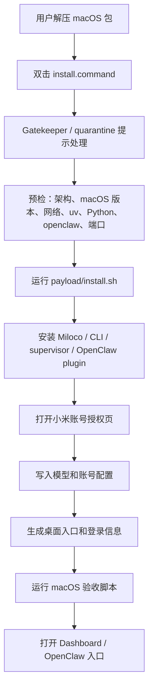

# macOS 适配 Spec

更新时间：2026-06-28
分支：`macOS`

## 背景和结论

本仓库当前已经保留官方 macOS/Linux 安装能力，但 easy-miloco 的一键 release 包只完成了 Windows 形态。macOS 适配不应从后端重写开始，而应优先把已有官方 macOS runtime、`scripts/install.sh`、`miloco-cli service`、OpenClaw 插件安装和本 fork 的中文化/验收经验包装成普通用户可双击或少命令运行的 macOS 分发包。

核心判断：

- 官方上游 `XiaoMi/xiaomi-miloco` 支持 macOS/Linux，Windows 仅推荐 WSL。
- 本 fork 当前 v0.5 release 是 Windows 包，根入口是 `install.bat` / `install.ps1`，payload 只内置 `miloco-linux-x86_64-2026.6.27.tar.gz`。
- v0.5 包内 `manifest.json` 已包含 `darwin-arm64`、`darwin-x86_64`、`linux-x86_64`、`linux-aarch64` 四个平台 bundle 元数据，但 Windows 包只复制 Linux x86_64 payload。
- 上游官方 v2026.6.18 release 已实际发布 `miloco-darwin-arm64-2026.6.18.tar.gz`，包内包含 macOS arm64 的 `miloco_miot-*-macosx_11_0_arm64.whl`、`miloco`、`miloco_cli`、OpenClaw plugin tgz 和模型包。
- 后端 MIoT camera native lib 已有 `backend/miot/src/miot/libs/darwin/arm64/libmiot_camera_lite.dylib` 和 `darwin/x86_64` 版本，`_load_dynamic_lib()` 会按 `platform.system()=="darwin"` 自动选择 dylib。

## CodeGraph 初始化记录

本轮已在仓库根目录执行 CodeGraph 初始化，生成本地 ignored 索引：

```text
Files: 577
Nodes: 13,140
Edges: 43,129
Backend: node:sqlite
Languages: python 425, typescript 63, tsx 48, yaml 36, javascript 5
```

`.codegraph/` 按仓库规则保持忽略，不提交。

## 已通读范围

本仓库重点入口：

- `README.md`：当前产品边界、目录树、Windows 一键包说明、官方/本 fork 差异。
- `scripts/build.sh`：多平台 wheel 和 bundle 构建，已覆盖 `darwin-arm64` / `darwin-x86_64`。
- `scripts/install.sh`、`scripts/install.py`：官方一键安装核心，已支持 macOS 平台检测、bundle 下载、uv tool 安装、模型解包、OpenClaw plugin 安装。
- `windows/build-release.ps1`、`windows/package/install.ps1`：当前 Windows 一键包的分发壳、payload 复制、桌面控制台、验证逻辑。
- `cli/src/miloco_cli/commands/service.py`：macOS/Linux 共同使用 supervisor 管理后端，端口反查优先 `lsof`，Linux fallback `ss`。
- `backend/miot/src/miot/camera.py`：macOS dylib 自动加载路径。
- `docs/windows/*`、`docs/scripts/*`：Windows 预检、后授权、验收、摄像头修复和发布脚本经验。

上游原仓库：

- `XiaoMi/xiaomi-miloco`，默认分支 `main`。
- 官方 README 明确支持 `macOS / Linux (run under WSL on Windows)`。
- 官方安装路径为 `curl -LsSf https://github.com/XiaoMi/xiaomi-miloco/releases/latest/download/install.sh | bash`。
- 官方 release v2026.6.18 包含 macOS arm64/x86_64 和 Linux arm64/x86_64 runtime。

release 包：

- fork v0.5：`easy-miloco-v0.5-windows.zip`，SHA-256 `526c10756ffdf21c90f70c29d66a3ed80e21c5adf9db2e6fb129d3242a84bada`。
- 上游 macOS arm64：`miloco-darwin-arm64-2026.6.18.tar.gz`，SHA-256 `eb6c65cf67db85525090a17647d09c3ad04717ee04756f761bb3c323b095f8ce`。

## 适配目标

第一阶段目标不是做原生 `.app`，而是做一个稳定、可解释、可回滚的 macOS 一键分发包，并同时支持两种安装方式：

1. Agent 一句话部署：用户把一段提示词交给 Agent，由 Agent 按 prepare/ask/finish 三阶段完成部署、记录证据并处理报错。
2. 懒人双击交互式部署：用户解压后双击 `install.command`，脚本用中文交互引导完成授权、模型配置、服务启动和验收。

建议包名：

```text
easy-miloco-v<version>-macos-arm64.zip
easy-miloco-v<version>-macos-x86_64.zip
```

包内建议结构：

```text
easy-miloco-vX-macos-arm64/
├── README.md
├── agent-prompt.md
├── install.command
├── install.sh
├── manifest.json
├── release-notes.md
├── docs/
├── scripts/
│   └── macos/
│       ├── macos-preflight.sh
│       ├── macos-miloco-validate.sh
│       ├── macos-post-auth-finish.sh
│       └── templates/
│           ├── miloco-console.command.tpl
│           └── openclaw-launcher.command.tpl
└── payload/
    ├── install.sh
    └── miloco-darwin-arm64-*.tar.gz
```

Intel Mac 可用同结构，只替换 `miloco-darwin-x86_64-*.tar.gz`。

## 官方当前 macOS 部署方式

截至 2026-06-28，官方 `XiaoMi/xiaomi-miloco` 当前 README 对 macOS 的定位是直接支持：系统要求写的是 `macOS / Linux`，Windows 才需要在 WSL 内运行。

官方提供三种入口：

1. Agent 安装：把下面这句发给 OpenClaw，让 Agent 自动安装：

   ```text
   Please install the Miloco plugin for me: https://raw.githubusercontent.com/XiaoMi/xiaomi-miloco/main/scripts/install-guide.md
   ```

2. 命令行一行安装：

   ```bash
   curl -LsSf https://github.com/XiaoMi/xiaomi-miloco/releases/latest/download/install.sh | bash
   ```

3. 源码构建安装：

   ```bash
   bash scripts/install.sh --dev
   ```

官方 Agent 安装指南实际是三阶段：

```text
Step 1: install.sh --agent-prepare
Step 2: Agent 先问小米账号授权，再问 Omni 模型配置
Step 3: install.sh --agent-finish --account-auth ... --omni-api-key ...
```

官方最新 release `v2026.6.18` 已发布 macOS runtime 资产：

```text
miloco-darwin-arm64-2026.6.18.tar.gz
miloco-darwin-x86_64-2026.6.18.tar.gz
install.sh
```

所以 easy-miloco 的 macOS 适配不是补底层 macOS 支持，而是补“面向普通用户的一键体验、验证脚本、桌面入口、日志和发版流程”。

## 用户流程 A：Agent 一句话部署

目标：和 Windows 的 Agent 一键部署提示词一样，用户只复制一段话给 Agent。Agent 负责下载/运行脚本、解释 JSON、按顺序询问账号和模型信息、写验证记录。

包内交付：

- `agent-prompt.md`：普通用户复制给 Agent 的完整提示词。
- `docs/macos/agent-install.md`：维护者版说明，写清命令、日志、验收和失败分支。
- `docs/scripts/macos-post-auth-finish.sh`：收到账号授权和模型 Key 后执行收尾。
- `docs/scripts/macos-miloco-validate.sh`：基础/满血验收。

标准流程：



Agent 提示词必须包含：

- 当前目标系统是 macOS，不进入 WSL。
- 下载慢时使用用户本机代理环境变量，但不能无限黑盒等待。
- 账号授权和模型 API Key 必须按顺序问，不要同时问。
- 先跑 BASIC_READY，再根据账号/模型/设备/摄像头状态判断 FULL_READY。
- 遇到摄像头问题按“设备云端 → LAN → scope → stream connected → engine active_sources → OpenClaw 视觉推理”分层排查。

## 用户流程 B：懒人双击交互式部署



双击入口职责：

- 检测当前目录和包完整性。
- 检测 Gatekeeper quarantine，并给出可复制修复命令。
- 检测架构，选择 `darwin-arm64` 或 `darwin-x86_64` payload。
- 调用 `payload/install.sh` 的交互模式。
- 安装后生成桌面入口和 `OpenClaw-login-info.txt`。
- 自动运行基础验收，失败时提示日志路径。

双击入口不负责：

- 不隐藏授权码/Key 的交互步骤。
- 不私自删除用户已有 `~/.openclaw/miloco`。
- 不把 OpenClaw 缺失伪装成 Miloco 后端失败。

## 工作拆分

### P0：验证官方 macOS 路线

目标：证明本机 macOS arm64 可以直接使用当前 `scripts/install.sh` 和 darwin bundle。

任务：

- 使用当前 fork 的 `scripts/build.sh --version <date>` 生成 `dist/miloco-darwin-arm64-*.tar.gz`，确认 manifest 中 darwin bundle 文件名、大小、SHA 均正确。
- 在干净 `MILOCO_HOME` 下执行 `bash dist/install.sh --skip-openclaw` 或 agent prepare 路径，验证 wheel 安装、模型解包和 `miloco-cli service status`。
- 验证 `backend/miot` 的 dylib 能被加载，至少跑 `miloco-cli doctor`、`miloco-cli service start/status/logs/stop`。
- 明确 OpenClaw CLI 在 macOS 的安装方式和最低版本，避免 installer 只提示 `npm install -g openclaw@latest` 却没有 node/npm 检查。

验收：

- `miloco-cli service start` 成功。
- `http://127.0.0.1:<port>/health` 返回 `status=ok`。
- `miloco-cli service stop` 后端口释放。
- 安装缓存和日志路径清晰。

### P1：macOS 分发壳

目标：复制 Windows 包的可用体验，但保留 macOS 语义。

任务：

- 新增 `macos/build-release.sh` 或 `scripts/build-macos-release.sh`，从 `dist/` 复制对应 darwin bundle、self-contained `install.sh`、docs 和 macOS scripts。
- 新增根入口 `install.command`，职责只做 Terminal 友好启动、quarantine 提示、当前目录切换、调用 `install.sh`，不要塞复杂业务。
- `install.command` 必须可执行，文本 LF，避免 macOS Finder 双击失败。
- 生成桌面入口：
  - `miloco控制台.command`
  - `OpenClaw 对话.command`
  - `OpenClaw-login-info.txt`
- 控制台功能对齐 Windows：
  - 重启 OpenClaw
  - 重启 Miloco
  - 整套重启
  - 停止服务
  - 打开 Dashboard
  - 打开消息渠道接入说明

验收：

- 解压后双击 `install.command` 可以进入安装向导。
- 包内不依赖 WSL、PowerShell、Windows 路径或 `.bat`。
- 用户可从桌面入口重启服务和打开页面。

### P2：macOS 预检和验收

目标：把 Windows 侧的诊断能力迁移成 macOS 原生检查，而不是只靠安装失败后看日志。

任务：

- 新增 `docs/scripts/macos-preflight.sh`：
  - `uname -s` 必须为 `Darwin`
  - `uname -m` 映射 `arm64` / `x86_64`
  - macOS 版本建议 12+，低版本 warning
  - 检查 `curl`、`tar`、`python3`、`lsof`
  - 检查 `uv`，缺失时说明 installer 会安装
  - 检查 `node` / `npm` / `openclaw`
  - 检查端口占用：Miloco 默认端口、OpenClaw gateway 端口
  - 检查 quarantine：包根或入口是否带 `com.apple.quarantine`
- 新增 `docs/scripts/macos-miloco-validate.sh`：
  - 服务状态
  - health
  - dashboard 根页面
  - OpenClaw gateway status
  - plugin 是否安装
  - account/model/camera 状态分层输出
- 新增 `docs/scripts/macos-post-auth-finish.sh`，复用 Windows 后授权脚本思路，但去掉 WSL wrapper。

验收：

- BASIC_READY：本机 Miloco 服务、Dashboard、OpenClaw gateway/plugin 基础链路可用。
- FULL_READY：账号、模型、设备、摄像头感知开关和 OpenClaw tool 调用链路可用。

### P3：发布和回滚

目标：macOS 包能像 Windows 包一样可发布、可校验、可替换、可回滚。

任务：

- 新增 macOS release validate 脚本，校验：
  - 必需文件存在。
  - `install.command` 可执行。
  - shell 脚本 LF。
  - payload darwin bundle SHA 与 manifest 一致。
  - 包内无 `.DS_Store`、`__MACOSX`、AppleDouble `._*`。
  - README / release notes 指向 macOS，不残留 Windows/WSL 主流程。
- 发布 GitHub Release 资产时，保留现有 Windows 脚本规则；macOS 可新增专用发布脚本，或扩展现有 `publish-github-release-asset.ps1` 的资产路径，但不要手写散落的 `gh release upload`。
- 回滚策略：
  - 不默认删除 `~/.openclaw/miloco`。
  - 提供 `install.command --uninstall` 或 `uninstall.command`。
  - 删除 uv tool、停止 supervisor/OpenClaw gateway、保留配置和日志；只有用户明确选择时才删除 home。

验收：

- release zip 本地解压后可双击。
- GitHub asset 的 size/sha 与本地记录一致。
- 重复安装不会因为同版本 uv tool 缓存造成旧代码残留。

## 需要避免的误区

- 不要把 macOS 适配做成 Windows WSL 的翻版。macOS 直接跑 darwin wheel 和 dylib，不需要 WSL。
- 不要优先做 `.app` 或 DMG。第一版先保证 zip + `.command` 可用，降低签名、公证和 Gatekeeper 成本。
- 不要把 OpenClaw 缺失当作 Miloco 安装失败。Miloco 基础服务应可 `--skip-openclaw` 验证，OpenClaw 是插件联动层。
- 不要在 release 包里只带 `install.sh` 而不带 darwin payload。普通用户路径必须尽量少下载大文件，且可校验。
- 不要提交 `.codegraph/`、`dist/`、临时解包目录或下载的 release 包。

## 风险清单

| 风险 | 影响 | 处理 |
| --- | --- | --- |
| Gatekeeper/quarantine 阻止双击 `.command` | 用户以为包坏了 | README 和 preflight 明确 `xattr -dr com.apple.quarantine <目录>`，入口也检测提示 |
| OpenClaw CLI 未安装或版本低 | plugin 装不上，Agent 入口不可用 | preflight 明确 node/npm/openclaw 状态；installer 保持可 `--skip-openclaw` |
| macOS 端口被占用 | 服务启动失败 | `lsof -ti tcp:<port>` 定位并给出用户可理解提示 |
| Intel Mac 缺验证机器 | x86_64 包可能只构建未实测 | release notes 标注验证矩阵，arm64 先作为主线 |
| 摄像头 LAN/组播在 macOS 权限或网络下异常 | 实时画面/感知失败 | 验收脚本区分设备云端、LAN 命中、SDK 出帧、感知开关四层 |
| AppleDouble 文件污染归档 | wheel/tgz glob 误选 `._*` | 沿用 `COPYFILE_DISABLE=1`，validate 强制扫描 |

## 推荐执行顺序

1. 先跑 P0，在当前 Mac 上直接验证官方 darwin 路线。
2. 再做 P1 的最小 macOS zip：`install.command` + payload + README。
3. 补 P2 预检/验收脚本，把本轮验证证据写入 `docs/macos/validation-record.md`。
4. 最后做 P3 发布脚本和 release 校验。

## 第一版交付定义

第一版 macOS 适配完成时，至少应提交：

- `docs/macos/macos-adaptation-spec.md`
- `docs/macos/index.md`
- `macos` 或 `scripts/macos` 下的打包/入口模板
- `docs/scripts/macos-preflight.sh`
- `docs/scripts/macos-miloco-validate.sh`
- `docs/scripts/macos-post-auth-finish.sh`
- macOS release validate 脚本
- 本地验证记录

第一版 release 可只支持 Apple Silicon：

```text
easy-miloco-v<version>-macos-arm64.zip
```

Intel Mac 在构建链路已经存在，但建议等有 x86_64 真机或 CI 验证后再标为正式支持。
