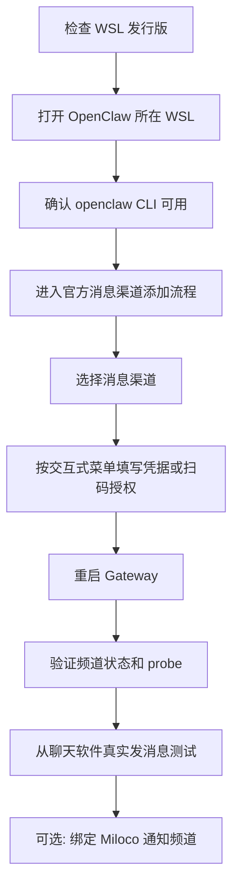

# OpenClaw 消息渠道手动接入指南

适用场景：用户刚安装完 OpenClaw / Miloco，想手动接入飞书、Telegram、QQ Bot、Slack 等消息渠道。

给 Agent 的一句话：

```text
请按 https://raw.githubusercontent.com/andy-JustSayWhen/easy-miloco/message-channel/docs/message-channel-manual-guide.md 指导我在 Windows + WSL 里手动接入 <渠道名> OpenClaw 消息渠道；不要改 WebUI，不要自造桥，按官方 openclaw channels add 交互式流程走，并在最后做 Gateway 状态、频道 probe、真实收发消息和 Miloco 通知绑定验收。
```

## 总流程



## 1. 检查 WSL 版本

在 Windows PowerShell 里执行。

命令格式：

```powershell
wsl -l -v
```

示例：

```powershell
wsl -l -v
```

你会看到类似：

```text
  NAME            STATE           VERSION
* Ubuntu-24.04    Running         2
```

记住 OpenClaw 所在的 WSL 名称。本文下面用 `Ubuntu-24.04` 举例；如果你的名称不同，请替换成实际名称。

## 2. 打开 WSL

命令格式：

```powershell
wsl -d <WSL发行版名称>
```

示例：

```powershell
wsl -d Ubuntu-24.04
```

进入后，后续命令都在 WSL 里执行。

## 3. 确认 OpenClaw 可用

命令格式：

```bash
export PATH="$HOME/.openclaw/bin:$HOME/.local/bin:$HOME/.local/share/uv/tools/supervisor/bin:$PATH"
openclaw --version
openclaw gateway status
```

示例：

```bash
export PATH="$HOME/.openclaw/bin:$HOME/.local/bin:$HOME/.local/share/uv/tools/supervisor/bin:$PATH"
openclaw --version
openclaw gateway status
```

重点看：

```text
Config (cli): ~/.openclaw/openclaw.json
Config (service): ~/.openclaw/openclaw.json
Connectivity probe: ok
```

如果 `openclaw` 找不到，说明当前 WSL 不是 OpenClaw 所在环境，或者 PATH 没加载正确。

## 4. 查看支持哪些消息渠道

命令格式：

```bash
openclaw channels list --all
```

示例：

```bash
openclaw channels list --all
```

含义：

- `configured`：已经配置过，会出现在 WebUI 频道页。
- `available`：插件可用，但还没完成配置。
- `installable`：OpenClaw 知道这个渠道，可以按官方流程安装或接入。

## 5. 进入官方消息渠道添加流程

优先使用 OpenClaw 官方交互式添加流程。

命令格式：

```bash
openclaw channels add
```

示例：

```bash
openclaw channels add
```

执行后，按菜单选择你要接入的渠道，例如：

```text
Feishu / Lark
Telegram
QQ Bot
Slack
Discord
WhatsApp
```

然后根据交互式提示继续。需要扫码就扫码，需要 token / AppID / AppSecret 就按提示填写。

如果你已经确定渠道 id，也可以先查看当前版本是否支持指定渠道参数。

命令格式：

```bash
openclaw channels add --help
```

示例：

```bash
openclaw channels add --help
```

如果帮助里支持 `--channel`，可用：

```bash
openclaw channels add --channel <渠道id>
```

示例：

```bash
openclaw channels add --channel feishu
```

```bash
openclaw channels add --channel telegram
```

```bash
openclaw channels add --channel qqbot
```

## 6. 常见渠道需要准备什么

### 飞书 / Lark

推荐走交互式流程：

```bash
openclaw channels add
```

选择 Feishu / Lark 后，按菜单完成扫码或应用授权。

如果当前 OpenClaw 提示使用 login，也按提示执行：

```bash
openclaw channels login --channel feishu
```

### Telegram

先在 Telegram 找 `@BotFather` 创建 bot，拿到 bot token。

常见 token 形式：

```text
123456789:ABCxxxxxxxxxxxxxxxx
```

然后运行：

```bash
openclaw channels add
```

选择 Telegram，按提示粘贴 bot token。

### QQ Bot

先准备 QQ 开放平台 Bot 的 AppID 和 AppSecret。

然后运行：

```bash
openclaw channels add
```

选择 QQ Bot，按提示填写 AppID / AppSecret。

如果当前 OpenClaw 支持 token 格式，可能会提示类似：

```bash
openclaw channels add --channel qqbot --token "AppID:AppSecret"
```

以菜单提示为准。

## 7. 重启 Gateway

配置完成后重启 OpenClaw Gateway。

命令格式：

```bash
openclaw gateway restart
```

示例：

```bash
openclaw gateway restart
```

然后确认状态：

```bash
openclaw gateway status
```

## 8. 验证消息渠道状态

命令格式：

```bash
openclaw channels status --channel <渠道id> --json --probe --timeout 15000
```

示例：飞书

```bash
openclaw channels status --channel feishu --json --probe --timeout 15000
```

示例：Telegram

```bash
openclaw channels status --channel telegram --json --probe --timeout 15000
```

示例：QQ Bot

```bash
openclaw channels status --channel qqbot --json --probe --timeout 15000
```

理想结果应包含：

```text
configured: true
running: true
probe ok: true
```

不同渠道字段名可能略有差异，以 `status` 和 `probe` 结果为准。

## 9. 真实收发消息测试

打开对应聊天软件，给 bot 发一句：

```text
你好
```

如果 OpenClaw 要求配对，查看配对请求。

命令格式：

```bash
openclaw pairing list <渠道id>
openclaw pairing approve <渠道id> <配对码>
```

示例：Telegram

```bash
openclaw pairing list telegram
openclaw pairing approve telegram 123456
```

示例：飞书

```bash
openclaw pairing list feishu
openclaw pairing approve feishu 123456
```

配对完成后，再从聊天软件给 bot 发一句。收到 OpenClaw agent 回复，才算入站和出站都通。

## 10. 可选：绑定 Miloco 通知频道

如果这个渠道要用于 Miloco 主动通知，在刚刚打通的聊天软件对话里发送：

```text
绑定通知频道
```

让 OpenClaw agent 调用 `miloco_notify_bind()`。

然后测试 Miloco 通知：

```text
发送一条 Miloco 通知测试消息
```

成功时应看到类似结果：

```json
{"ok": true, "channel": "<渠道id>"}
```

并且你应在对应聊天软件里收到测试通知。

## 11. 手动排查命令

查看当前已配置渠道：

```bash
openclaw channels list
```

查看全部可安装渠道：

```bash
openclaw channels list --all
```

查看 Gateway 状态：

```bash
openclaw gateway status
```

查看渠道帮助：

```bash
openclaw channels --help
openclaw channels add --help
openclaw channels status --help
```

查看 OpenClaw 配置文件：

```bash
python3 -m json.tool ~/.openclaw/openclaw.json | less
```

备份配置文件：

```bash
cp ~/.openclaw/openclaw.json ~/.openclaw/openclaw.json.bak.channel-$(date +%Y%m%d-%H%M%S)
```

## 12. 判断是否完成

完成标准：

- `openclaw channels list` 能看到该渠道。
- `openclaw channels status --channel <渠道id> --json --probe` 通过。
- 你从聊天软件给 bot 发消息，OpenClaw agent 能回复。
- 如果用于 Miloco 通知，`miloco_im_push` 测试消息能发到该渠道。

不要只看到 WebUI 里出现渠道就认为完成。最终以真实收发消息和 probe 结果为准。
