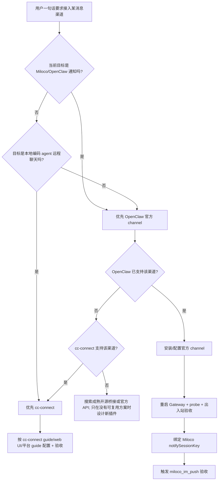

# Agent 一句话接入消息渠道通用指南

目标：用户只说一句话，例如“把这个 agent 接入 Telegram”或“把 OpenClaw/Miloco 接入 QQ”，agent 读完本文后直接完成接入、绑定和验收。

推荐一句话：

```text
请按 https://raw.githubusercontent.com/andy-JustSayWhen/easy-miloco/message-channel/docs/message-channels-agent-guide.md 直接把当前 OpenClaw/Miloco 接入 <渠道名> 消息渠道；优先复用 OpenClaw 官方 channel，其次复用 cc-connect 等成熟开源方案；完成安装、授权、通知绑定和出入站验收，不要只给步骤。
```

## 总原则

1. 先复用，后补脚本，最后才考虑写插件。
2. Miloco 场景默认优先走 OpenClaw channel，因为 Miloco 的 `miloco_im_push`、`miloco_notify_bind` 已经绑定到 OpenClaw session 模型。
3. 如果 OpenClaw 官方已支持该渠道，直接使用官方 channel / plugin / CLI，不要自己造桥。
4. 如果用户要把 Codex、Claude Code、Cursor、Gemini CLI 等本地编码 agent 接到聊天软件，且不强依赖 Miloco 通知，优先评估 cc-connect。
5. 每次写 OpenClaw 配置、session store 或 cc-connect 配置前先备份。
6. 最终验收不能只看服务启动，要验证：channel probe、普通出站、真实入站、agent 回复、Miloco notify 绑定。

## 快速决策树



## OpenClaw 路线

### 1. 识别渠道名

把用户口语归一成 OpenClaw channel id：

| 用户说法 | 优先 channel id | 备注 |
| --- | --- | --- |
| 飞书、Lark | `feishu` | 本分支最佳实践已有独立流程 |
| Telegram、TG | `telegram` | 官方文档推荐为最快速 setup 之一 |
| QQ、QQ Bot | `qqbot` | 官方 QQ Bot API 路线；个人 QQ 可另看 cc-connect 的 NapCat / OneBot |
| 企业微信、WeCom | `wecom` 或外部插件 | 先查 OpenClaw 当前版本和插件市场 |
| 钉钉、DingTalk | `ddingtalk` / `dingtalk` | 先查 OpenClaw 插件搜索结果 |
| Slack / Discord / WhatsApp / Matrix / LINE | 对应官方 channel | 按官方 docs 配置 |

### 2. 只读检测

在 OpenClaw 所在机器执行：

```bash
openclaw --version
openclaw channels list --all --json || true
openclaw plugins search <channel> || true
openclaw channels status --channel <channel> --json --probe --timeout 15000 || true
openclaw plugins inspect miloco-openclaw-plugin || true
```

如果是 Miloco 通知接入，还要读：

```bash
python3 - <<'PY'
import json
from pathlib import Path
p = Path.home() / ".openclaw" / "openclaw.json"
s = Path.home() / ".openclaw" / "agents" / "main" / "sessions" / "sessions.json"
print("openclaw_config=", p)
print("session_store=", s)
PY
```

### 3. 安装或启用官方 channel

优先按官方 docs 或 CLI 提示执行。常见模式：

```bash
# 下载型 plugin
openclaw plugins install <plugin-name-or-clawhub-ref>
openclaw plugins enable <plugin-id>

# 有 channels add 的渠道
openclaw channels add --channel <channel> --token '<token-or-composite-token>'

# 交互式配置兜底
openclaw channels add openclaw configure --section channels

openclaw gateway restart
openclaw channels status --channel <channel> --json --probe --timeout 15000
```

不要死记命令。agent 应先查当前 OpenClaw 版本的 `openclaw channels --help`、`openclaw channels add --help`、`openclaw plugins search <channel>`，再执行。

### 4. 渠道专项要点

#### 飞书

直接复用本分支脚本：

```bash
bash docs/scripts/message-channel-router.sh feishu --interactive --install --auth --bind --validate
```

已安装一键包时，Windows 用户也可以打开 `Miloco 控制台.bat`，选择 `接入飞书消息渠道`。

#### Telegram

优先用 OpenClaw 官方 Telegram channel：

1. 让用户在 Telegram 找 `@BotFather` 创建 bot，拿 bot token。
2. 写入 `channels.telegram.botToken`，或使用官方支持的 env fallback。
3. 启动 / 重启 Gateway。
4. 第一次私聊默认需要 pairing，按 `openclaw pairing list telegram` 和 `openclaw pairing approve telegram <CODE>` 批准。
5. 验证 `openclaw channels status --channel telegram --json --probe`。
6. 从 Telegram 给 bot 发真实消息，看 agent 是否回复。

如用户在中国大陆网络下 Telegram API 不稳定，优先设置代理环境变量或 `channels.telegram.proxy`，不要在直连上长时间硬等。

#### QQ

先区分两种“QQ”：

- 官方 QQ Bot：优先 OpenClaw `qqbot`。创建 QQ 开放平台 bot，拿 AppID 和 AppSecret，执行类似 `openclaw channels add --channel qqbot --token "AppID:AppSecret"`，再重启 Gateway。
- 个人 QQ / NapCat / OneBot：OpenClaw 官方路径不合适时，优先 cc-connect 的 QQ / NapCat / OneBot 路线；不要自己实现 OneBot 桥。

QQ Bot 验证时不要只验证 `message send`。必须从 QQ 客户端真实发消息给 bot，并确认 session store 有 `lastChannel=qqbot` 和 `lastTo`。

## Miloco 通知绑定

OpenClaw channel 配好后，Miloco 主动通知还需要绑定到一个有效 IM session。

优先路径：

1. 用户从目标聊天软件给 bot 发一条消息。
2. OpenClaw 生成或更新 session entry。
3. 用户在该聊天对话里说“绑定通知频道”。
4. agent 调 `miloco_notify_bind()`。
5. 触发一次 Miloco 通知，确认工具返回 `{"ok": true, "channel": "<channel>"}`。

安装器 / 自动化辅助路径：

1. 明确拿到目标用户 id / open_id / chat id。
2. 普通出站验证成功。
3. 备份 `~/.openclaw/openclaw.json` 和 `~/.openclaw/agents/main/sessions/sessions.json`。
4. 补齐 session entry 的 `lastChannel`、`lastTo`、`lastAccountId`。
5. 写入 `plugins.entries["miloco-openclaw-plugin"].config.notifySessionKey`。
6. 重启 Gateway，再通过 Gateway/WebChat 请求触发 `miloco_im_push` 验收。

注意：不要在普通 CLI agent 里直接调用 `miloco_im_push` 做最终验收。它依赖 Gateway 请求上下文里的 subagent runtime。

## cc-connect 路线

当用户目标是“把本地编码 agent 接到聊天软件”，或者 OpenClaw 当前渠道不成熟，优先用 cc-connect。

一句话给 agent：

```text
Follow https://raw.githubusercontent.com/chenhg5/cc-connect/refs/heads/main/INSTALL.md to install and configure cc-connect for <平台名> and <agent 类型>; ask me only for missing credentials, then run it and verify I can chat with the agent from that platform.
```

执行策略：

1. 先读取 cc-connect 官方 `INSTALL.md`。
2. 优先用 `cc-connect web` 做可视化配置。
3. 如有平台 CLI 快捷入口，优先用快捷入口，例如 Feishu 的 `cc-connect feishu setup --project <project>`。
4. 没有快捷入口时，按平台 guide 写 `~/.cc-connect/config.toml`。
5. 启动 `cc-connect`，从目标聊天软件真实发消息，确认 agent 回复。

常见 cc-connect 适用渠道：

| 渠道 | cc-connect 推荐路径 |
| --- | --- |
| Telegram | BotFather token + `[[projects.platforms]] type = "telegram"` |
| QQ 个人号 | NapCat / OneBot v11，配置 `ws_url` |
| QQ Bot 官方 | `type = "qqbot"` 或 cc-connect QQ guide 中的官方 bot 路线 |
| 飞书 | `cc-connect feishu setup --project <project>` |
| 钉钉 / Slack / Discord / WeChat Work / Matrix | 按 cc-connect 平台 guide |

## Agent 执行清单

接到用户一句话后，agent 必须自己推进：

1. 判断目标：Miloco/OpenClaw 通知，还是本地编码 agent 远程控制。
2. 查本机已有组件：`openclaw`、`cc-connect`、WSL / Linux / Windows 环境。
3. 查官方支持：OpenClaw docs / `openclaw channels list --all` / `openclaw plugins search` / cc-connect docs。
4. 选择路线并说明一句：OpenClaw 官方、cc-connect、还是其他成熟开源桥。
5. 收集最少凭据：bot token、AppID/AppSecret、QR 授权、chat id。缺什么问什么，不要问一长串。
6. 写配置前备份。
7. 安装、配置、启动服务。
8. 做出站验证。
9. 做真实入站验证。
10. 如果是 Miloco，绑定 notifySessionKey 并触发 `miloco_im_push` 验收。
11. 把复用命令、配置路径、日志路径、失败原因写入本项目 docs 或报告。

## 验收口径

基础 ready：

- channel/plugin 已安装或内置可用。
- Gateway / cc-connect 服务已启动。
- channel probe 或平台连接检查通过。

出站 ready：

- agent 或 CLI 能向目标聊天软件发送测试消息。

入站 ready：

- 用户从聊天软件给 bot 发消息后，agent 收到并回复。

Miloco notify ready：

- `notifySessionKey` 指向有效 session。
- session entry 有 `lastChannel` 和 `lastTo`。
- Gateway 路径触发 `miloco_im_push` 返回 ok。
- 用户在目标聊天软件收到 Miloco 测试通知。

## 参考来源

- OpenClaw 官方 Chat channels: https://docs.openclaw.ai/channels
- OpenClaw Telegram: https://docs.openclaw.ai/channels/telegram
- OpenClaw QQ Bot: https://docs.openclaw.ai/channels/qqbot
- cc-connect: https://github.com/chenhg5/cc-connect
- cc-connect agent install guide: https://raw.githubusercontent.com/chenhg5/cc-connect/refs/heads/main/INSTALL.md
