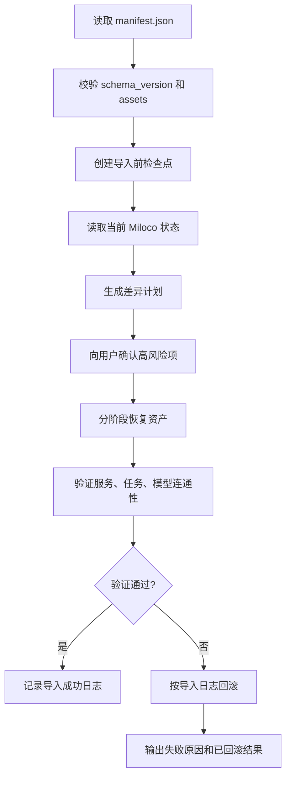

# Miloco 备份与 Agent 恢复规格

状态：导出已落地，Agent 导入待落地
日期：2026-06-23
适用范围：miloco 面板、后端 API、Agent 恢复流程

## 目标

用户安装 easy-miloco 后，应能在 miloco 面板侧边栏进入「备份」页面，选择可迁移的家庭资产并导出一个 Agent 可读的恢复包。未来用户重装、更新失败、迁移机器或误改配置时，可以把恢复包交给 Agent，由 Agent 交互式恢复，而不是把文件简单覆盖回去。

本规格暂不要求在 WebUI 里做手动导入页面。v1 只做导出和 Agent 恢复契约，导入由 Agent 根据恢复包内容完成。

## 不做什么

- 不备份「感知范围」。
- 不备份 Miloco / MI local 运行配置，例如端口、服务目录、设备发现缓存、小米登录态、局域网运行参数。
- 不把恢复实现为原始目录或 SQLite 文件的直接覆盖。
- 不把通知配置拆成独立资产。任务里的通知意图、提醒文本、动作描述应随任务资产导出；具体发到哪个当前可用渠道，由 Agent 恢复时重新映射。
- 不默认导出日志、trace、性能报告、快照等诊断资产。它们属于诊断包，不属于家庭资产备份。

## v1 备份资产清单

| 资产 | 必选 | 来源 | 恢复方式 | 备注 |
| --- | --- | --- | --- | --- |
| 家庭档案 | 是 | `home-profile/` | Agent 读取档案内容，经后端 API 或 CLI 写回 | 包含家庭结构、偏好、房间描述、长期事实 |
| 家庭成员 | 是 | `person` 表、身份库文件 | Agent 对比当前成员后新增或合并 | 包含姓名、别名、身份绑定、可识别样本索引 |
| 家庭任务 | 是 | `task`、`task_link`、`rule`、任务记录相关表 | Agent 按任务意图重建任务、规则、提醒动作 | 包含任务描述、规则条件、启停状态、提醒文案 |
| 模型配置 | 是 | `config.json` 中 model/omni 配置 | Agent 对比后写入配置并测试连通性 | 包含档案名、base_url、model、api_key、active 档案 |

后续可选扩展：

| 资产 | 纳入条件 |
| --- | --- |
| 自定义 Agent 提示词或插件配置 | 确认它们属于用户长期资产，而不是安装环境 |
| 面板偏好 | 确认存在跨设备迁移价值 |
| 历史任务记录 | 用户明确希望迁移历史统计，而不只是恢复任务本身 |

## 任务资产与通知的边界

家庭任务应导出任务本体及其执行规则，而不是只导出一句自然语言描述。最少应包含：

- 任务 ID、描述、状态、创建时间、更新时间。
- 规则 ID、规则启用状态、触发条件、进入/退出动作。
- 任务与规则之间的关联关系。
- 提醒动作描述，例如“通过飞书消息提醒 Andy”和“卧室音箱播报某句话”。
- 提醒文本，例如“Andy，注意坐姿，肩颈前倾了，调整一下”。

通知配置不单独备份，是因为它往往依赖当前安装环境：

- 当前机器是否已登录飞书或 OpenClaw。
- 当前家庭里有哪些可用音箱、摄像头、成员 ID。
- 当前服务是否有对应 webhook、token、权限。

因此恢复家庭任务时，Agent 应把导出的通知动作视为“通知意图”，再映射到当前环境中可用的渠道和设备。如果找不到原来的渠道，Agent 应向用户确认替代方案，或者先恢复为禁用任务。

## 当前已验证的任务落点

通过 OpenClaw 的飞书消息渠道创建任务后，任务最终落在 Miloco 的任务与规则系统里，而不是只存在飞书聊天记录里。

已确认的两个任务样例：

| 任务 | task_id | rule_id | 关键内容 |
| --- | --- | --- | --- |
| 坐姿前倾提醒 | `posture_forward` | `71e511b0-8b15-47dd-9159-9faaac967be3` | 电脑桌前出现头部前伸、圆肩、上半身前倾等姿态时提醒 |
| 久坐 30 分钟提醒 | `desk_sit_30min` | `f145279d-f513-4b51-8440-c2d2442b7d8e` | 在电脑桌前坐满 30 分钟后提醒站起来活动 |

这些信息说明，任务恢复不能只恢复聊天记录，也不能只恢复自然语言摘要。需要重建任务、规则、触发条件和提醒动作。

## 导出包格式

导出文件建议命名：

```text
miloco-agent-restore-pack-YYYYMMDD-HHMMSS-<8位随机后缀>.zip
```

压缩包内建议结构：

```text
manifest.json
RESTORE.md
home-profile/
  index.json
  profile.md
  profile.json
  candidates.json
members/
  members.json
  identity-lib/
tasks/
  tasks.restore.json
  task-table.json
  rule-table.json
  task-link-table.json
  records/
model/
  model-profiles.json
  active-model.json
```

`manifest.json` 必须包含：

```json
{
  "kind": "miloco-agent-restore-pack",
  "schema_version": 1,
  "created_at": "2026-06-23T00:00:00+08:00",
  "source": {
    "app": "easy-miloco",
    "miloco_home_hint": "/home/andywu/.openclaw/miloco"
  },
  "assets": ["home_profile", "members", "tasks", "model_config"],
  "restore_contract": "agent_restore_v1"
}
```

`RESTORE.md` 面向 Agent，写清楚：

- 这是 Agent 恢复包，不是直接覆盖包。
- 先创建导入前检查点。
- 逐项对比当前环境和备份内容。
- 任务恢复时优先恢复为 disabled 或 draft，再经用户确认启用。
- 恢复失败时按导入日志回滚。

## WebUI 规格

侧边栏新增入口：

- 名称：备份
- 路由建议：`/backup` 或现有 Tab key `backup`
- 页面职责：选择资产、导出恢复包、展示最近一次导出结果

页面控件：

- 资产复选框：家庭档案、家庭成员、家庭任务、模型配置。
- 主按钮：导出备份。
- 状态区：导出中、导出成功、导出失败。
- 成功后显示文件名、大小、导出时间。

页面不做：

- 不做手动导入按钮。
- 不让用户选择底层数据库表。
- 不展示低层运行配置。

## 后端 API 规格

建议新增：

```http
POST /api/admin/backup/export
Content-Type: application/json

{
  "assets": ["home_profile", "members", "tasks", "model_config"]
}
```

返回：

```http
200 OK
Content-Type: application/zip
Content-Disposition: attachment; filename="miloco-agent-restore-pack-20260623-203000.zip"
```

错误语义：

| 状态码 | 含义 |
| --- | --- |
| 400 | 未选择资产或资产名不支持 |
| 401/403 | 未授权 |
| 500 | 导出过程中读取资产失败 |

导出要求：

- 使用逻辑导出，不直接把 `miloco.db` 原样塞进恢复包。
- SQLite 读取应使用一致性快照或短事务。
- 每个资产导出失败时，应明确返回失败资产名和错误信息。
- 对模型配置，v1 允许导出完整恢复所需字段。未来如果要支持脱敏包，应作为单独导出模式，而不是默认丢失可恢复性。

## Agent 恢复流程

Agent 收到恢复包后，应执行以下流程：



恢复顺序：

1. 家庭档案。
2. 家庭成员。
3. 模型配置。
4. 家庭任务。

原因：

- 家庭任务可能引用家庭成员和模型能力。
- 模型配置恢复后才能验证任务条件或感知说明是否可用。
- 任务最后恢复，便于先以 disabled/draft 状态落地，再按当前环境启用。

## 导入策略

Agent 应支持三种策略：

| 策略 | 适用场景 | 行为 |
| --- | --- | --- |
| 增量合并 | 默认 | 保留当前已有资产，只新增缺失项，冲突时询问 |
| 覆盖同名资产 | 用户明确要求恢复旧状态 | 同名家庭成员、任务、模型档案以备份为准 |
| 只预览 | 用户想先看会改什么 | 只输出差异计划，不写入 |

禁止策略：

- 禁止无提示地全量覆盖当前 `miloco.db`。
- 禁止在无法确认设备映射时直接启用任务。
- 禁止静默丢弃无法恢复的通知动作。

## 回滚规格

Agent 导入前必须创建 checkpoint。建议目录：

```text
$MILOCO_HOME/restore-checkpoints/
  20260623-203000-import-<session-id>/
    checkpoint.json
    miloco.db
    home-profile/
    identity-lib/
    config.json
    tasks-before.json
    import-journal.jsonl
```

`checkpoint.json` 应包含：

- `import_session_id`
- 导入时间
- 当前 miloco 版本
- 当前服务状态
- checkpoint 文件清单和 hash
- 计划导入的资产

`import-journal.jsonl` 每一步记录：

- step id
- asset
- action
- before reference
- after reference
- status
- rollback action

回滚粒度：

| 粒度 | 要求 |
| --- | --- |
| 全量回滚 | 恢复导入前的 DB、home-profile、identity-lib、config，并重启服务 |
| 单资产回滚 | 优先支持任务和模型配置 |
| 单步骤回滚 | 后续增强，用于复杂任务重建 |

回滚原则：

- 任务恢复应优先通过 API/CLI 删除或停用新建任务，而不是直接改库。
- 配置恢复应写回导入前 `config.json` 并重启或热加载。
- 如果导入过程创建了外部计划任务、webhook、Agent 订阅，应在 journal 中记录补偿动作。

## v0.2 验收标准

规格落地后至少满足：

- WebUI 侧边栏出现「备份」入口。
- 用户可选择四类资产并下载 zip。
- zip 内有 `manifest.json` 和 `RESTORE.md`。
- 导出的任务包能看到 task、rule、link 和提醒动作描述。
- 不包含感知范围和 Miloco/MI local 运行配置。
- Agent 可以依据恢复包生成差异计划。

## 后续导入验收标准

Agent 导入能力落地后至少满足：

- Agent 导入前会创建 checkpoint。
- 发生导入错误时，可以回滚到导入前状态。

## 后续实现建议

后端优先实现逻辑导出模块，放在 `backend/miloco/src/miloco/admin/backup_export.py`，由 admin router 暴露下载接口。前端新增 `BackupPage`，接入 `web/src/components/Sidebar.tsx` 和 `web/src/App.tsx`。恢复能力先沉淀为 Agent runbook 和恢复包内 `RESTORE.md`，等导出包稳定后再补 CLI 或专用 Agent Skill。
