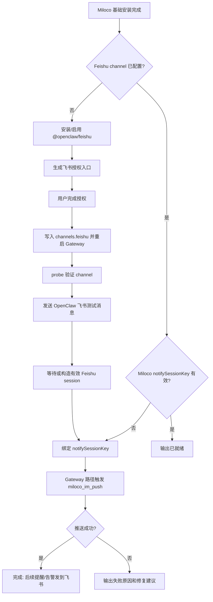

# Feishu 消息渠道接入工作流规格

日期: 2026-06-23
状态: Draft
目标读者: Miloco / OpenClaw 安装器、Windows 一键包、OpenClaw 插件、后续产品化接入负责人

## 背景

当前 Miloco 已具备通过 OpenClaw IM channel 发送主动通知的核心能力:

- Miloco OpenClaw 插件注册 `miloco_im_push`、`miloco_notify_bind`、`miloco_habit_suggest`。
- 插件配置包含 `notifySessionKey`, 用于指定 Miloco 主动通知投递到哪个 OpenClaw IM session。
- `miloco-notify` skill 已定义「绑定通知频道」的自然语言流程。
- <windows-sample-host> 已手工验证过 OpenClaw 接入飞书、agent 飞书出站、Miloco `miloco_im_push` 推送到飞书。

但这些能力还没有形成新用户可发现、可重复执行、可验收的 onboarding 流程。一键安装目前会安装 Miloco OpenClaw 插件和注册工具白名单, 但不会安装或配置 Feishu channel, 也不会引导用户完成飞书授权、绑定通知会话、验证真实入站。

## 原手工接入路径

来源: `docs/windows/windows-sample-host-log.md` 的 `2026-06-22 18:47-19:00 OpenClaw 接入飞书消息渠道` 留档。

已验证路径:

1. 查看 channel 状态: `openclaw channels list --all --json`。
2. 安装官方飞书插件: `openclaw plugins install clawhub:@openclaw/feishu`。
3. 启用插件: `openclaw plugins enable feishu`。
4. 重启 Gateway: `openclaw gateway restart`。
5. 通过 Feishu 插件 app registration 生成授权入口, 用户在飞书侧完成授权。
6. 写入 OpenClaw 配置 `channels.feishu`。
7. 验证 channel: `openclaw channels status --channel feishu --json --probe --timeout 15000`。
8. 验证普通出站: `openclaw message send --channel feishu --target <open_id> --message <text> --json --verbose`。
9. 验证 agent 飞书投递: `openclaw agent --reply-channel feishu --reply-to <open_id> --deliver`。
10. 绑定 Miloco 通知 session: 写入 `plugins.entries.miloco-openclaw-plugin.config.notifySessionKey`, 并确保 session store entry 包含 `lastChannel=feishu`、`lastTo=<open_id>`、`lastAccountId=default`。
11. 通过 Gateway/WebChat 请求触发 `miloco_im_push`, 验证返回 `{"ok": true, "channel": "feishu"}`。

已知未完全验收:

- 用户从飞书客户端真实给 bot 发消息后, OpenClaw 是否能自动回复。
- 飞书插件日志中的 `openKeyedStore is only available for trusted plugins` 当前不阻塞出站和 probe, 但需要作为观察项。

## 产品目标

让用户在完成 Miloco 一键安装后, 可以快速接入飞书消息渠道, 并让 Miloco 的提醒、告警、定时任务通知能稳定发到飞书。

必须满足:

- 可发现: 安装完成后、首次需要 IM 通知时、用户主动说「绑定飞书/通知发到飞书」时都能引导。
- 可重复: 脚本可反复执行, 已安装/已配置/已绑定时不破坏现状。
- 可诊断: 每一步给出明确状态、下一步动作、失败原因。
- 可验收: 结束前至少验证 Feishu channel probe、OpenClaw 出站、Miloco `miloco_im_push`。
- 不把用户 app secret 或 open_id 写进仓库文档; 只落在用户本机 OpenClaw 配置和 session store。

## 推荐入口

### 1. 安装后可选引导

在 `scripts/install.py` 的基础安装完成后, 检测:

- `openclaw` CLI 存在。
- Miloco OpenClaw 插件已安装。
- `openclaw channels status --channel feishu --json --probe` 不可用或未配置。

若满足条件, 提示:

> 是否现在接入飞书消息通知? 接入后, Miloco 的提醒、告警、任务通知可以发到飞书。

用户选择「是」后进入 Feishu onboarding。用户选择「否」时, 摘要里给出后续命令。

### 2. 独立脚本

新增独立脚本, 供 Windows workflow、远程排障、文档教程和重复执行复用。

建议路径:

- WSL/Linux 主实现: `docs/scripts/wsl-feishu-channel-onboard.sh`
- Windows 包装入口: `docs/scripts/win-miloco-workflow.ps1 -Action Feishu`
- 如后续要纳入正式发布安装器, 再迁移或复用到 `scripts/install.py`

建议能力:

```bash
bash wsl-feishu-channel-onboard.sh --install --auth --bind-notify --validate
bash wsl-feishu-channel-onboard.sh --status --json
bash wsl-feishu-channel-onboard.sh --validate --strict
```

### 3. 运行时自然语言触发

当用户在 OpenClaw 对话里说:

- 「接入飞书」
- 「通知发到飞书」
- 「绑定飞书通知」
- 「把 Miloco 告警发到这个飞书」
- 「绑定通知频道」

agent 应先加载 `miloco-notify` skill。若当前会话已经是有效 IM session, 直接调用 `miloco_notify_bind()`。若 Feishu channel 未安装或未配置, 引导用户执行 Feishu onboarding 工作流。

## 工作流



## 详细规格

### 状态检测

脚本应先做只读检测:

- `openclaw --version`
- `openclaw plugins inspect feishu` 或 `openclaw channels list --all --json`
- `openclaw channels status --channel feishu --json --probe --timeout 15000`
- `openclaw plugins inspect miloco-openclaw-plugin`
- `openclaw config get 'plugins.entries["miloco-openclaw-plugin"].config.notifySessionKey' --json`
- session store 中目标 session 是否存在 `lastChannel` 和 `lastTo`

输出状态建议:

```json
{
  "feishuPluginInstalled": true,
  "feishuChannelConfigured": true,
  "feishuChannelRunning": true,
  "feishuProbeOk": true,
  "milocoPluginLoaded": true,
  "notifySessionKey": "agent:main:feishu:dm:<open_id>",
  "notifySessionValid": true,
  "ready": true
}
```

### 安装 Feishu 插件

若 Feishu channel 未安装:

```bash
openclaw plugins install clawhub:@openclaw/feishu
openclaw plugins enable feishu
openclaw gateway restart
```

要求:

- 已安装时跳过。
- 已安装但未启用时只启用。
- 每次改 OpenClaw 插件状态后重启 Gateway。
- 记录命令输出摘要, 失败时保留完整 stderr 给报告。

### 授权与配置

优先使用 Feishu 插件提供的 app registration / onboarding 能力生成授权 URL。

要求:

- 支持交互模式: 打印 URL, 等用户完成授权, 轮询结果。
- 支持 agent/非交互模式: 输出 URL 和 `nextAction`, 让外层 workflow 暂停等待。
- 授权完成后写入 `channels.feishu`。
- 写配置前备份 OpenClaw 配置文件。

建议备份命名:

```text
~/.openclaw/openclaw.json.bak.miloco-feishu-YYYYMMDD-HHMMSS
~/.openclaw/agents/main/sessions/sessions.json.bak.miloco-feishu-YYYYMMDD-HHMMSS
```

### Channel 验证

必须执行:

```bash
openclaw channels status --channel feishu --json --probe --timeout 15000
```

判定:

- `configured=true`
- `running=true`
- `probe.ok=true`

若 `probe.ok=false`, 输出:

- Feishu 插件是否运行。
- appId/appSecret/domain/connectionMode 是否存在。
- Gateway 是否重启成功。
- 最近 Gateway 日志路径。

### 出站验证

当已经拿到授权用户 `open_id` 后, 执行:

```bash
openclaw message send \
  --channel feishu \
  --target <open_id> \
  --message "Miloco 飞书消息渠道测试成功。" \
  --json \
  --verbose
```

判定:

- `ok=true` 或返回消息 ID。
- 失败时停止绑定 `notifySessionKey`, 避免绑定到不可达 channel。

### 通知绑定

优先路径:

1. 用户从飞书真实发一条消息给 bot。
2. OpenClaw 生成带 `lastChannel=feishu`、`lastTo=<open_id>` 的 session entry。
3. 用户在该飞书对话中发送「绑定通知频道」。
4. agent 调 `miloco_notify_bind()`。

脚本辅助路径:

若是安装器/自动化场景, 可在明确拿到 `open_id` 且出站验证通过后, 补齐 session store entry, 再写入 `notifySessionKey`。这是 <windows-sample-host> 手工验收用过的路径。

绑定要求:

- `notifySessionKey` 指向的 entry 必须包含 `lastChannel` 和 `lastTo`。
- `lastChannel` 必须为 `feishu`。
- `lastAccountId` 默认 `default`。
- 写 session store 和 OpenClaw config 前必须备份。
- 写完后重新读取验证, 不只相信写入命令返回。

### Miloco 推送验收

不要在普通 CLI agent 上直接调用 `miloco_im_push`; 该工具内部依赖 Gateway 请求上下文中的 `api.runtime.subagent.run`。

验收应通过 Gateway/WebChat 请求触发一次 agent turn, 让 agent 调 `miloco_im_push`。

成功判定:

- chat history 或工具返回包含 `{"ok": true, "channel": "feishu"}`。
- 用户飞书端收到测试通知。

### 真实入站验收

这是补齐 <windows-sample-host> 留档缺口的必做项:

1. 用户从飞书客户端给 bot 发送一条消息, 如「Miloco 入站测试」。
2. OpenClaw Gateway 收到事件。
3. agent 生成回复并投递回同一飞书对话。
4. session store 产生或更新该飞书 session。

成功判定:

- `channels status` 中 `lastInboundAt` 有值或日志显示收到飞书事件。
- 飞书客户端收到 agent 回复。
- session entry 有 `lastChannel=feishu`、`lastTo=<open_id>`。

若入站失败但出站成功, onboarding 可以标记为 `outbound_ready=true`、`inbound_ready=false`, 并提示用户检查飞书事件订阅、权限和 websocket 连接状态。

## 与现有模块的关系

### `scripts/install.py`

当前安装阶段:

1. 环境检查
2. 包安装
3. 服务初始化
4. 米家账号绑定
5. Omni 模型配置
6. 感知模型下载
7. OpenClaw 插件安装

建议新增第 8 个可选阶段:

8. Feishu channel onboarding

该阶段默认交互询问, 支持参数跳过:

```bash
bash scripts/install.sh --skip-feishu
bash scripts/install.sh --setup-feishu
```

非交互模式默认不阻塞安装, 只输出 `nextAction`。

### `docs/scripts/win-miloco-workflow.ps1`

建议新增 action:

```powershell
-Action Feishu
-Action FeishuStatus
-Action FeishuValidate
```

内部转调 WSL 脚本, 复用 `Distro`、`OpenClawPort`、`Json`、`ShowCommand`。

### `docs/scripts/wsl-miloco-validate.sh`

建议新增可选 Feishu 检查:

```bash
bash wsl-miloco-validate.sh --with-feishu
bash wsl-miloco-validate.sh --strict-full --with-feishu
```

默认基础校验不因 Feishu 缺失失败。只有显式 `--with-feishu` 时检查 Feishu channel。

### `plugins/skills/miloco-notify`

现有 `references/channel-config.md` 负责「绑定当前 IM 会话」。建议补一段「Feishu channel 未安装/未配置」的分流:

- 已在飞书会话中: 调 `miloco_notify_bind()`。
- 有 IM session 但不是飞书: 允许绑定当前 IM, 同时提示可接入飞书。
- 无 IM session 或 Feishu 未配置: 引导运行 Feishu onboarding。

### `plugins/openclaw/src/tools/notify.ts`

当前 `miloco_im_push` 在无可用 IM channel 时返回:

```text
no available IM channel — owner has never interacted via IM
```

建议后续增强为结构化结果:

```json
{
  "ok": false,
  "needsChannelSetup": true,
  "recommendedChannel": "feishu",
  "nextAction": "Run Feishu channel onboarding, then bind notify channel."
}
```

这样 agent 能区分「还没绑定」和「根本没有可用 IM channel」。

## 错误处理

| 场景 | 检测 | 处理 |
| --- | --- | --- |
| Feishu 插件未安装 | `channels list --all` 或 `plugins inspect` | 自动安装并启用 |
| Feishu 已安装但未运行 | `channels status.running=false` | 重启 Gateway, 再 probe |
| 授权未完成 | app registration 轮询超时 | 输出授权 URL 和继续命令 |
| probe 失败 | `probe.ok=false` | 打印 channel 配置摘要和 Gateway 日志路径 |
| 普通出站失败 | `message send` 非 ok | 不绑定 Miloco 通知, 输出 open_id/权限/连接检查 |
| session entry 缺 `lastChannel/lastTo` | 读 session store | 提醒用户先从飞书发消息, 或由脚本补齐 |
| `miloco_im_push` 在 CLI agent 中失败 | error 含 `subagent methods` | 改用 Gateway/WebChat 触发验收 |
| 真实入站失败 | `lastInboundAt=null` 或无回复 | 标记 outbound ready, 提示检查事件订阅/权限 |

## 安全与配置边界

- 不把飞书 app secret、open_id、session key 写入仓库文档。
- 用户凭据只写入用户本机 `~/.openclaw/openclaw.json` 和 session store。
- 写配置前必须备份。
- 日志与报告中默认隐藏 app secret; 如用户明确要求归档完整排障记录, 再按用户指令保留原文。
- 脚本应避免把完整 secret 打到终端, 除非是用户显式的导出/诊断模式。

## 验收标准

基础 ready:

- Feishu 插件已安装并启用。
- `channels.feishu` 已配置。
- Gateway 正常运行。
- `channels status --probe` 返回 configured/running/probe ok。

出站 ready:

- `openclaw message send --channel feishu` 成功。
- `openclaw agent --reply-channel feishu --deliver` 成功。

Miloco notify ready:

- `notifySessionKey` 存在且指向有效 Feishu session。
- session entry 有 `lastChannel=feishu`、`lastTo=<open_id>`。
- Gateway 路径触发 `miloco_im_push` 返回 `ok=true/channel=feishu`。
- 飞书客户端收到 Miloco 测试通知。

入站 ready:

- 用户从飞书客户端发消息后 OpenClaw 收到事件。
- agent 回复投递回同一飞书对话。
- session store 更新 `lastInteractionAt` 或等价字段。

## 推进建议

分三步推进:

1. 先实现 `docs/scripts/wsl-feishu-channel-onboard.sh` 和 `--status/--validate`, 用脚本固化 <windows-sample-host> 手工路径。
2. 再把 Windows workflow 接上 `-Action Feishu`, 让一键包用户可以从桌面/PowerShell 继续配置。
3. 最后把安装器摘要和 `miloco-notify` 运行时提示接上, 形成安装后和首次通知时的双入口。

这样可以先把可重复执行和验收补齐, 再决定是否把 Feishu 作为安装器的可选交互步骤。
