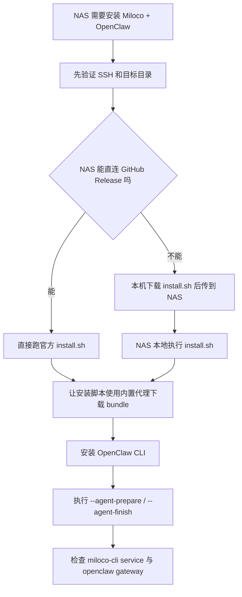

# NAS01 OpenClaw + Miloco 安装记录

用途：沉淀在中国网络环境下，把 OpenClaw 和 Miloco 部署到 NAS 类 Linux 主机时的可复用经验。该记录是一次 NAS01 实机安装复盘，不是 Windows 一键部署流程。

## 背景

目标是在 NAS 主机上部署 Miloco 插件并补齐 OpenClaw 运行环境。安装过程中，SSH、主机权限和目录本身不是主要问题，真正卡点是 NAS 直连 GitHub Release 下载不稳定。

## 关键结论

### GitHub Release 直连不可靠

官方安装命令可能在 NAS 上失败：

```bash
curl -LsSf https://github.com/XiaoMi/xiaomi-miloco/releases/latest/download/install.sh | bash -s -- --agent-prepare
```

典型现象：

```text
curl: (18) HTTP/2 stream 1 was not closed cleanly before end of the underlying stream
```

继续测试 `curl --http1.1`、`wget --spider`，可能都卡在连接 `github.com:443`。在中国网络环境下，不能依赖 NAS 直接拉 GitHub Release 安装脚本。

### 先本机下载安装脚本，再传到 NAS

更稳的路径是：

1. 在网络更稳定的本机下载官方 `install.sh`。
2. 把脚本传到 NAS。
3. 在 NAS 本地执行脚本。
4. bundle 下载阶段继续复用安装脚本内置代理。

### GitHub 镜像需要逐个试

不要默认某一个 GitHub 镜像一定可用。应准备多条候选源，逐个测试可达性、TLS、重定向和实际文件下载结果。

一次实测中，Miloco 安装脚本内嵌的这些 bundle 代理可用：

- `https://gh-proxy.com/https://github.com/XiaoMi/xiaomi-miloco/releases/download`
- `https://gh-proxy.org/https://github.com/XiaoMi/xiaomi-miloco/releases/download`
- `https://gh.idayer.com/https://github.com/XiaoMi/xiaomi-miloco/releases/download`

### OpenClaw 官方链路可能仍可用

OpenClaw 相关链路在同一 NAS 环境中可能正常：

- `https://openclaw.ai/install-cli.sh`
- `https://registry.npmjs.org`
- `https://nodejs.org/dist/index.json`
- `https://astral.sh/uv/install.sh`

因此不要把“GitHub Release 拉不动”等同于“整台 NAS 无法安装”。Miloco 安装脚本和 bundle 下载、OpenClaw CLI、Node/npm、uv 是不同链路，要分别测。

## 推荐执行路径



## 后续排障规则

- 下载失败先分清是 install.sh 下载失败，还是 bundle 下载失败。
- install.sh 下载失败时，优先本机下载后传输。
- bundle 下载失败时，优先复用脚本内置代理，不要现场硬改一条未知镜像。
- OpenClaw、Node/npm、uv 分别测，不要被 GitHub Release 单点失败误导。
- 所有 NAS 上的长期配置应落在用户目录下的 OpenClaw/Miloco 运行目录，避免依赖临时工作目录。
