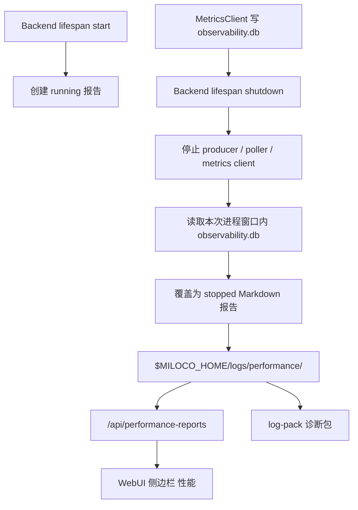

# 性能报告与 WebUI 规格复盘

日期：2026-06-23  
适用范围：Miloco backend、observability、Web 面板性能入口

## 背景

此前 Miloco 已有实时性能数据链路：

- 感知 cycle、Agent run、Gate、Omni、内存等指标写入 `$MILOCO_HOME/observability.db`。
- Web 面板存在隐藏调试入口 `#perf`，用于查看实时聚合图表。

缺口是：后端每次运行结束后没有一份独立、可归档、可随诊断包带走的“本次运行性能报告”。用户也无法从 Miloco 主面板侧边栏显式进入历史报告查看页。

本轮补齐两件事：

- 每次后端运行生成一份 Markdown 性能报告。
- 在 Miloco WebUI 侧边栏新增“性能”入口，展示这些报告。

## 目标

1. 每次 backend 进程运行都有一份报告文件。
2. 报告默认保存到 `$MILOCO_HOME/logs/performance/`。
3. 报告内容能支持排查“慢在哪里、是否丢包、是否 Omni 错误、Agent 是否慢”。
4. WebUI 侧边栏显式出现“性能”，作为普通面板入口。
5. 日志打包时自动包含性能报告，方便远程排障。
6. 原隐藏 `#perf` 实时调试页保留，避免破坏已有调试流程。

非目标：

- 不把报告文件做成可编辑文档。
- 不在报告里写入 API Key、OAuth code、设备 PIN 等敏感配置。
- 不替代 `observability.db` 的实时图表查询能力。

## 数据流



## 后端设计

### 报告文件

路径：

```text
$MILOCO_HOME/logs/performance/miloco-perf-YYYYMMDD-HHMMSS-<runid>.md
```

命名约束：

- `YYYYMMDD-HHMMSS` 使用进程启动时间。
- `runid` 为 8 位十六进制短 ID。
- HTTP API 只暴露匹配 `miloco-perf-\d{8}-\d{6}-[0-9a-f]{8}.md` 的文件，防止路径穿越和任意文件读取。

生命周期：

- 启动时先写入 `status=running` 的报告。
- 正常关闭时，在 metrics 队列 drain 完后，按启动到关闭的时间窗口重新生成 `status=stopped` 报告。
- 写报告是 best-effort，失败只记录日志，不阻断后端启动或关闭。

### 报告内容

报告至少包含：

| 区块 | 内容 |
| --- | --- |
| Run | run_id、status、version、started_at、ended_at、duration、perf_enabled、observability_db |
| Summary | cycle 数、skip 率、丢包数/率、Omni 错误率、P95 RTF、Agent 调用数 |
| Stage Latency | decode、collect、convert、gate、identity、omni、log 的 avg/P50/P75/P95/P99 |
| Agent | 按 source 聚合的 count、成功率、平均耗时、webhook RTT |
| Slow Tools | 慢工具 Top N |
| Gate | Gate 通过率和设备打分摘要 |
| Errors | Agent 错误前缀 Top N |

特殊情况：

- `perf.enabled=false`：报告写明未采集 observability 指标。
- `observability.db` 不存在：报告写明没有找到 DB。
- schema 不兼容或 DB 读取失败：报告写明失败原因。

### API

新增路由：

```text
GET /api/performance-reports
GET /api/performance-reports/{filename}
```

鉴权：

- 使用与面板一致的 Bearer token。
- 路由不依赖 `perf.enabled` 是否开启；历史报告仍可查看。

返回形态：

- 列表接口返回报告元数据：文件名、mtime、size、run_id、status、version、started_at、ended_at、duration、perf_enabled。
- 详情接口返回同样元数据加 `content` Markdown 全文。

## WebUI 设计

侧边栏新增 tab：

```text
性能
查看性能报告
```

页面布局：

- 左侧：运行报告列表，显示开始时间、状态、耗时、run_id。
- 右侧：报告详情，渲染 Markdown 标题、列表、表格和 inline code。
- 空状态：无报告时显示“暂无性能报告”。
- 错误态：列表或详情加载失败时显示错误信息。

与旧入口关系：

- 新“性能”tab 展示运行报告。
- 旧 `#perf` 仍是实时性能调试视图，继续用于观察最近 1h/6h/24h/3d 的曲线和列表。

## 关键文件

后端：

- `backend/miloco/src/miloco/observability/performance_report.py`
- `backend/miloco/src/miloco/observability/performance_report_router.py`
- `backend/miloco/src/miloco/main.py`
- `backend/miloco/src/miloco/admin/log_pack.py`
- `backend/miloco/src/miloco/config/settings.py`

前端：

- `web/src/components/PerformanceReportsPage.tsx`
- `web/src/components/Sidebar.tsx`
- `web/src/App.tsx`
- `web/src/api/index.ts`
- `web/src/lib/types.ts`
- `web/src/i18n/locales/*/nav.json`
- `web/src/i18n/locales/*/perf.json`

测试：

- `backend/miloco/tests/observability/test_performance_report.py`
- `backend/miloco/tests/observability/test_performance_report_router.py`
- `backend/miloco/tests/admin/test_log_pack.py`
- `web/tests/i18n.test.ts`

## 验收记录

本轮已执行：

```bash
cd backend
uv run pytest miloco/tests/observability/test_performance_report_router.py miloco/tests/observability/test_performance_report.py
uv run ruff check miloco/src/miloco/observability/performance_report_router.py miloco/src/miloco/main.py miloco/tests/observability/test_performance_report_router.py
uv run ruff format --check miloco/src/miloco/observability/performance_report_router.py miloco/src/miloco/main.py miloco/tests/observability/test_performance_report_router.py

cd web
pnpm typecheck
pnpm test -- tests/i18n.test.ts
pnpm build
```

结果：

- 后端新增报告 API 测试通过。
- 前端类型检查通过。
- 前端生产构建通过。
- i18n 测试通过。
- Vite dev server 可访问 `http://127.0.0.1:5173/`。

已知限制：

- 本轮没有通过浏览器自动截图工具完成视觉截图验收；已经通过 TypeScript、Vite build 和 dev server 入口 200 验证编译与基础可访问性。
- Windows 下更宽的 admin 测试集合仍会被既有 `fcntl` 依赖阻塞，这不是本功能新增问题。

## 后续建议

1. 在运行报告页增加“下载报告”按钮，直接保存当前 Markdown。
2. 在报告列表增加按 status / 日期过滤。
3. 在报告详情中提取 Summary 关键指标成顶部 KPI。
4. 如果未来报告数量变多，给 `$MILOCO_HOME/logs/performance/` 加保留策略。
5. 若需要远程协作，把报告 API 加入诊断包预览接口，减少手动下载。
