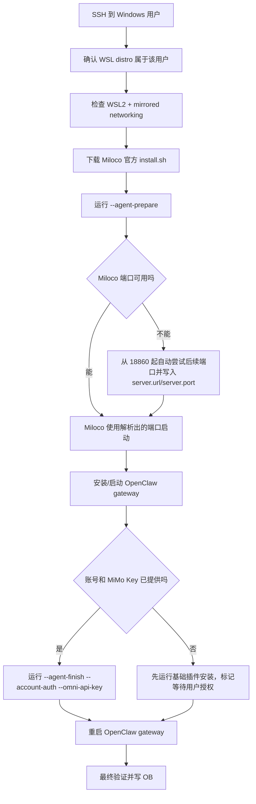

# Windows 部署教程：Agent 一键版

适用场景：目标机器是 Windows，但 Miloco 需要跑在 WSL 内；你希望把安装、排障、验证交给 Agent 通过 SSH 执行。

本文是 [../install-guide.md](../install-guide.md) 路由后的 Windows 子指南。Agent 从 README 的一句话进入总入口后，如果目标系统是 Windows，只读本文继续执行。

第一次部署先看 [Windows部署总入口](index.md)。摄像头异常按 [摄像头问题快速定位与修复Runbook](camera-runbook.md) 分层处理。

## 前置条件

- 目标 Windows 可以 SSH 登录；如果还没有 WSL，Agent 先按本文安装 WSL2 和 Ubuntu。
- SSH 用户必须能进入目标 Windows 账号对应的 WSL 发行版；WSL distro 是 Windows 用户级资源，不是所有 Windows 用户共享。
- WSL 内可以访问 GitHub、OpenClaw、Node.js、PyPI；国内网络建议显式提供代理，例如 `http://127.0.0.1:7897`。
- 如果要使用摄像头本地流，Windows 侧应启用 WSL mirrored networking，并允许 Hyper-V 防火墙入站。
- 小米账号和 MiMo API Key 可以后置配置；不提供时只会完成基础服务和插件安装。

## Agent 输入清单

最少需要：

- Windows SSH：`<windows_user>@<host_or_tailscale_ip>`
- Windows 登录用户是否就是拥有 WSL distro 的用户。
- 目标 WSL distro 名称，未知时让 Agent 用 `wsl -l -v` 自动发现。
- 是否已有代理端口，例如 `127.0.0.1:7897`。
- 是否要启用摄像头本地感知。

满血阶段还需要：

- 小米 OAuth payload / 授权码。
- MiMo API Key。
- 如果多个家庭或多个摄像头，需要用户确认目标 `home_id` 和摄像头 `did`。

## 给 Agent 的一键指令模板

```text
请通过 SSH 在 WIN 电脑上部署 Xiaomi Miloco：

- Windows SSH：<windows_user>@<host_or_tailscale_ip>
- WSL distro：Ubuntu-24.04
- WSL 用户：<linux_user>
- 如需代理：127.0.0.1:7897
- Obsidian 实录路径：<你的部署实录.md>

要求：
1. 不在 Windows 原生安装 Miloco，只在 WSL 内安装。
2. 先检查 wsl -l -v、WSL2、.wslconfig mirrored networking、Hyper-V 防火墙。
3. 使用官方 release installer 的 agent 模式：
   - install.sh --agent-prepare
   - 按顺序收集小米 OAuth payload 和 MiMo API Key
   - install.sh --agent-finish --account-auth ... --omni-api-key ...
4. Miloco 端口由安装器自动选择，默认从 18860 起尝试；只需把最终端口同步到 server.url、server.port、诊断和桌面控制台。
5. 安装 OpenClaw CLI 和 gateway，确认 miloco-openclaw-plugin loaded。
6. 最后必须验证：
   - miloco-cli service status
   - curl http://127.0.0.1:<miloco_port>/health
   - openclaw gateway status
   - openclaw plugins inspect miloco-openclaw-plugin
   - Windows 侧 curl.exe 能访问 Miloco 和 OpenClaw
7. 把每个坑和修复写进 OB 实录。
```

## Agent 执行流程



## 没有 WSL 时

Agent 先在目标 Windows PowerShell 执行：

```powershell
wsl --install -d Ubuntu-24.04
wsl -l -v
```

如果正确命令仍提示 `--install` 无效，走旧系统兜底：

```powershell
dism.exe /online /enable-feature /featurename:Microsoft-Windows-Subsystem-Linux /all /norestart
dism.exe /online /enable-feature /featurename:VirtualMachinePlatform /all /norestart
wsl --set-default-version 2
```

然后重启 Windows，再安装 Ubuntu。已存在同名发行版时不要 `--unregister`，先进入已有 distro 判断是否可用。

## 推荐脚本入口

如果已经把源码仓库 `docs/scripts/` 或 release 包 `scripts/windows/` 里的脚本传到目标 Windows，Agent 优先运行统一入口：

```powershell
powershell.exe -ExecutionPolicy Bypass -File C:\Users\<user>\AppData\Local\Temp\win-miloco-workflow.ps1 -Action AllBasic -Distro Ubuntu-24.04 -MilocoPort <miloco_port> -OpenClawPort 18789
```

如需把当前状态留档或发给别的 Agent，先生成报告：

```powershell
powershell.exe -ExecutionPolicy Bypass -File C:\Users\<user>\AppData\Local\Temp\win-miloco-workflow.ps1 -Action Report -Distro Ubuntu-24.04 -MilocoPort <miloco_port> -OpenClawPort 18789 -ReportPath C:\Users\<user>\AppData\Local\Temp\miloco-report.txt
```

生成小米账号授权链接：

```powershell
powershell.exe -ExecutionPolicy Bypass -File C:\Users\<user>\AppData\Local\Temp\win-miloco-workflow.ps1 -Action BindUrl -Distro Ubuntu-24.04
```

收到 OAuth payload 和 MiMo Key 后：

```powershell
powershell.exe -ExecutionPolicy Bypass -File C:\Users\<user>\AppData\Local\Temp\win-miloco-workflow.ps1 -Action Finish -AuthPayload '<小米 OAuth payload>' -MimoApiKey '<MiMo API Key>' -OmniModel '<Omni model>' -OmniBaseUrl '<Omni Base URL>' -Distro Ubuntu-24.04 -MilocoPort <miloco_port> -OpenClawPort 18789
```

统一入口只负责编排检查与收尾；安装本体仍按官方 `install.sh --agent-prepare` / `--agent-finish` 执行。

如果目标机没有这些脚本，Agent 直接使用官方 installer 完成安装；脚本只用于预检、报告、授权收尾和验收，不是 Miloco 安装本体。

## 必须让 Agent 记录的关键输出

```powershell
wsl -l -v
```

```bash
miloco-cli service status
curl -fsS http://127.0.0.1:<miloco_port>/health
miloco-cli doctor
openclaw gateway status
openclaw plugins inspect miloco-openclaw-plugin
```

Windows 侧也要验证：

```powershell
curl.exe -fsS http://127.0.0.1:<miloco_port>/health
curl.exe -I http://127.0.0.1:18789/
```

## 常见自动修复策略

| 现象 | Agent 处理 |
| --- | --- |
| `wsl --install` 参数无效 | 确认命令没有粘贴重复；若正确命令仍无效，使用 DISM 启用 WSL/VirtualMachinePlatform 后重启 |
| `ERROR_ALREADY_EXISTS` | 不重复安装 WSL，直接进入已有 distro |
| GitHub 直连超时 | 给 `curl`、`uv`、`npm` 注入 `http_proxy/https_proxy/all_proxy` |
| `uv tool install` 长时间无输出 | 查 `ss -tpn` 和 `du -sh ~/.cache/uv`，缓存仍增长就继续等 |
| Miloco bind `address already in use` | 查 Windows `netsh interface ipv4 show excludedportrange protocol=tcp`，从 `18860` 起自动选择未占用端口 |
| WSL 内无 Linux `node` 且无法 sudo | 用户目录安装 Node tarball，并把 `node/npm/npx` 链到 `~/.local/bin` |
| OpenClaw gateway 未启动 | `openclaw gateway --dev --bind loopback --port 18789 install --port 18789` 后 `openclaw gateway start` |

## 交付判定

基础安装完成后至少应给出：

- Miloco 后端 URL，例如 `http://127.0.0.1:18860/`，以安装器最终报告为准。
- OpenClaw Dashboard URL：`http://127.0.0.1:18789/`。
- `miloco-openclaw-plugin` 状态：`loaded/enabled`。
- 小米账号是否已绑定。
- Omni/MiMo API Key 是否已配置。
- 保留的 warning，例如 WSL 内无 sudo 导致 `iptables` 只能提示权限不足。

满血安装必须继续验证：

```bash
miloco-cli account status          # data.is_bound=true
miloco-cli config get model.omni.api_key --value-only
miloco-cli device list             # TSV 输出里有设备行，不只是表头
miloco-cli scope camera list --pretty
```

摄像头满血还要逐个目标摄像头 did 验收：`is_online=true`、`in_use=true`、`connected=true`、`/api/perception/engine/status` 的 `active_sources` 包含目标 did，并且在 OpenClaw 聊天中能描述对应摄像头画面。若任一项失败，按 [摄像头问题快速定位与修复Runbook](camera-runbook.md) 的六层模型定位，不要直接重装。

如果账号或 API Key 缺失，Agent 不应宣称“满血完成”，只能宣称“基础服务与 OpenClaw 插件就绪，等待账号/API Key”。

## 需要用户介入的节点

以下节点不适合无人值守：

- 小米账号 OAuth：用户打开 `miloco-cli account bind --no-wait` 生成的链接，登录后复制授权码。
- MiMo API Key：用户从小米 MiMo 平台获取并提供。

Agent 收到授权码和 API Key 后优先执行：

```powershell
powershell.exe -ExecutionPolicy Bypass -File C:\Users\<user>\AppData\Local\Temp\win-miloco-workflow.ps1 -Action Finish -AuthPayload '<授权码>' -MimoApiKey '<MiMo API Key>' -OmniModel '<Omni model>' -OmniBaseUrl '<Omni Base URL>' -Distro Ubuntu-24.04 -MilocoPort <miloco_port> -OpenClawPort 18789
```

如果统一入口不可用，再手动执行 `miloco-cli account authorize`、`miloco-cli config set`、`miloco-cli service restart`、`openclaw gateway restart`。
