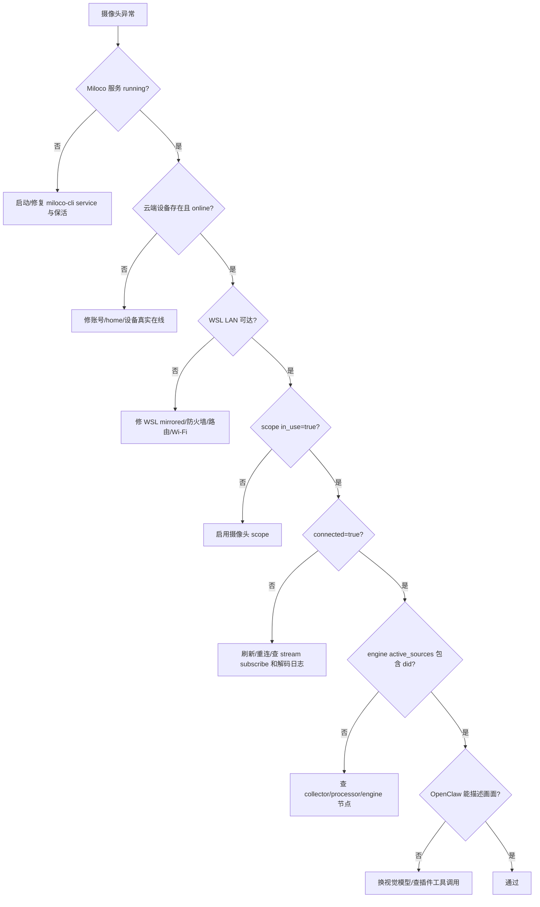

# 摄像头问题快速定位与修复 Runbook

用途：给 Windows + WSL 部署 Miloco/OpenClaw 的用户和 Agent 使用。遇到摄像头离线、看不到画面、WebUI 与 OpenClaw 状态不一致、左上角 Nodes failed、视觉问答失败时，按本文快速定位并修复。

核心原则：不要只看一个 UI 状态。摄像头链路至少分为 6 层：云端设备、LAN 可达、Miloco scope、视频流连接、感知引擎、OpenClaw 视觉推理。先定位断在哪一层，再修对应层。

## 1. 六层状态模型

| 层级 | 看什么 | 关键字段/证据 | 失败含义 |
|---|---|---|---|
| 1. 米家云端设备 | 账号、家庭、设备是否存在 | `/api/miot/home`、`miloco-cli device list`、米家 App | 账号未绑定、home 错、设备真离线或不在该家庭 |
| 2. LAN 可达 | WSL 是否能访问摄像头局域网地址 | `ip addr`、`ping -I <iface> <camera_ip>`、`arp -n` | WSL 网络模式、防火墙、Wi-Fi、路由或摄像头真实网络问题 |
| 3. Miloco scope | 是否被纳入感知范围 | `/api/miot/scope/cameras` 的 `in_use`、`is_online` | 未启用、scope/home 错、后端状态判断滞后 |
| 4. 视频流连接 | 后端是否真正订阅到画面 | `connected=true`、`/api/perception/devices` | LAN SDK manager 缺失、流订阅失败、解码问题 |
| 5. 感知引擎 | 摄像头是否进入 active_sources | `/api/perception/engine/status` | collector/processor/engine 没拿到源，或节点故障 |
| 6. OpenClaw 视觉推理 | Agent 是否能基于画面回答 | OpenClaw 聊天逐个点名摄像头询问画面 | 模型无视觉能力、插件链路断、提示未触发摄像头工具 |



## 2. 快速取证命令

在 WSL 内执行，优先用真实 token；token 可从 `~/.openclaw/miloco/config.json` 的 `server.token` 读取。

```bash
TOKEN=$(python3 - <<'PY'
import json, pathlib
p = pathlib.Path.home() / '.openclaw/miloco/config.json'
print(json.loads(p.read_text()).get('server', {}).get('token', ''))
PY
)

miloco-cli service status
curl -s -H "Authorization: Bearer $TOKEN" http://127.0.0.1:1886/api/miot/scope/cameras | python3 -m json.tool
curl -s -H "Authorization: Bearer $TOKEN" http://127.0.0.1:1886/api/perception/devices | python3 -m json.tool
curl -s -H "Authorization: Bearer $TOKEN" http://127.0.0.1:1886/api/perception/engine/status | python3 -m json.tool
tail -n 200 ~/.openclaw/miloco/log/miloco-backend.log
```

若怀疑 LAN 问题：

```bash
ip addr
ip route
ping -c 3 -I <wsl_lan_iface> <camera_ip>
arp -n | grep '<camera_ip>'
```

若是远程 Windows + SSH，不要在一行里硬拼复杂引号。复杂诊断脚本先 scp 到 `C:\Users\<user>\AppData\Local\Temp\*.sh`，再用：

```powershell
wsl.exe -d Ubuntu-24.04 -- bash /mnt/c/Users/<user>/AppData/Local/Temp/diagnose.sh
```

## 3. 常见现象与处理

| 现象 | 最快定位 | 常见根因 | 修复 | 验收 |
|---|---|---|---|---|
| WebUI 显示某摄像头离线，但米家 App 在线 | 查 `/api/miot/home` 与 `/api/miot/scope/cameras` | SDK `lan_online` 滞后，云端在线但 LAN 状态未刷新 | 不要直接过滤；让云端在线设备进入 tentative stream 重连，并给失败重试加退避 | `is_online=true` 或至少 `connected=true`，最终 active_sources 包含 did |
| OpenClaw 能看到画面，但 WebUI/Minicloud 显示离线 | 对比 `is_online`、`connected`、`active_sources` | UI 或 scope 在线口径落后于真实 stream 状态 | 以 `connected` 和 active_sources 为更强证据，修在线口径和刷新逻辑 | UI、API、OpenClaw 三者一致 |
| 左上角 `Nodes: <camera> failed`，但聊天能描述画面 | 查 `/api/monitor/nodes`、engine status、日志 | 节点状态未随重连清零，或部分非关键流失败 | 先确认视频流是否成功；若是音频/旧节点失败，不算满血通过，需清理错误来源 | camera/collector/processor/engine 无持续 failed，或错误被明确降级 |
| `in_use=false` | `/api/miot/scope/cameras` | 摄像头未纳入感知范围 | 用 CLI 或 WebUI 启用目标 did | `in_use=true` |
| `connected=false`，但 `is_online=true` | 后端日志中的 stream subscribe | LAN manager 缺失、SDK refresh 不完整、摄像头刚恢复 | 触发 refresh/reconnect；必要时重启 Miloco 后端；修复 stale LAN 过滤 | `connected=true` |
| 日志出现 `AUDIO_G711A` 和 `NoneType.decode` | `tail -n 200 miloco-backend.log` | 摄像头音频流格式不被当前解码链路稳定处理 | 家庭视觉感知默认禁用 audio stream，只保留 decoded video | 后续重启不再出现新的 audio decode 错误，视频仍可用 |
| 后端启动后过一会儿没了 | `miloco-cli service status`、Windows 任务计划 | SSH/临时 WSL 会话拉起的后台进程被父会话带走，或 supervisor PATH 不完整 | 用 `miloco-cli service start` 管理服务；Windows 侧用计划任务保活 | `service status running=true managed=true`，保活日志持续 `already running` |
| 三台摄像头只接入两台 | 比较 cloud list、scope list、engine active_sources | 单台摄像头 `lan_online` 滞后、未启用或流订阅失败 | 分 did 逐层查，不要用“总数大概对”结案 | 每个目标 did 都 `online/in_use/connected/active_sources` 通过 |
| OpenClaw 回答“我看不到画面” | 查所选模型和插件工具调用 | 使用了不支持视觉的 chat 模型，或插件未调用 Miloco 视觉工具 | 摄像头视觉推理用支持视觉的模型；MiMo v2.5 可用于视觉，v2.5-pro 不应作为视觉模型 | 逐个摄像头提问能描述画面内容 |

## 4. Agent 处理规则

1. 不要把“摄像头问题”统一归为安装失败。先确认服务、账号、模型、设备、摄像头分别在哪一层失败。
2. 不要只看 `is_online`。`connected=true` 和 `active_sources` 说明后端已经拿到真实画面，是更强证据。
3. 不要只看 UI 截图结案。必须用 API、日志、OpenClaw 真实对话三方交叉验收。
4. 不要一上来重装。摄像头问题大多是账号/home/scope/LAN/stream/model 中一层的问题，重装通常不会修好。
5. 只要改代码，必须补测试、热修远端运行包、重启/保活、提交推送，并把根因和验收写入部署实录。
6. 当用户要求“所有摄像头都能看”时，验收必须逐个 did 点名，不允许只证明其中一个画面可用。

## 5. 满血验收标准

部署交付时，摄像头部分必须同时满足：

| 项目 | 标准 |
|---|---|
| 摄像头清单 | 所有目标 did 都在 `/api/miot/scope/cameras` 中出现 |
| 在线与启用 | 每个目标 did 都是 `is_online=true`、`in_use=true` |
| 真实连接 | 每个目标 did 都是 `connected=true` |
| 感知引擎 | `/api/perception/engine/status` 的 `active_sources` 包含每个目标 did |
| OpenClaw 视觉 | 在 OpenClaw 聊天里逐个询问摄像头画面，能返回与画面相符的描述 |
| UI 一致性 | Miloco WebUI 不再把已 connected 的摄像头显示为离线 |
| 日志 | 后端日志无持续 camera/collector/processor/engine failed，无新的 audio decode 风暴 |

<windows-sample-host> 的实战根因与修复记录见 [<windows-sample-host>部署实录](windows-sample-host-log.md#2026-06-23 01:35 摄像头离线彻底修复：LAN 状态滞后、音频流、后台保活)。
## 6. 2026-06-23 补充：假 LIVE/黑屏的判定规则

遇到“WebUI 显示 LIVE，但卡片或弹窗黑屏/一直正在连接/提示连不上摄像头”时，优先按下面规则处理：

| 证据 | 解释 | 处理 |
|---|---|---|
| SDK 返回 `reg_id` | 只代表订阅请求被接受 | 不能据此标记 `connected=true` |
| 12 秒内无 decoded video 首帧 | 摄像头没有真正产出画面 | 断开订阅，记录失败退避，UI 不显示 LIVE |
| 30 秒无新 decoded video 帧 | 已有连接变成陈旧画面 | 断开并等待重连 |
| WebUI 数量大于实际画面数 | UI 使用了启用数量而非 streaming 数量 | “在感知”应显示真实 streaming/live 摄像头数 |

一句话结论：摄像头是否可用，以 decoded video 首帧和持续帧更新为准；`online`、`in_use`、SDK `reg_id` 都不是最终验收标准。

<windows-sample-host> 的对应实战记录见 [<windows-sample-host>部署实录](windows-sample-host-log.md#2026-06-23 02:05 摄像头二次修复：reg_id 不等于真实 connected，必须等首帧)。
### 日志判读补充

摄像头排障时，日志中的“订阅尝试”和“真实连接”必须区分：

| 日志/字段 | 正确解释 |
|---|---|
| `Started decode video frame stream ... reg_id=N` | SDK 接受了订阅请求，不代表画面已到 |
| `Device connection pending or not live yet` | 订阅处于等待首帧或不可用状态，不应进入 LIVE/active_sources |
| `Camera <did> subscribed but produced no decoded video frame within 12s` | 首帧超时，必须断开并降级 |
| `connected=true` + active_sources 包含 did | 才能作为后端真实拿到画面的证据 |

## 7. 2026-06-23 补充：PIN、LAN 与 PPCS 的分界

同一台机器上不同摄像头可能同时出现不同根因，不要用一个修复解释所有 did。

| 证据 | 判定 | 处理 |
|---|---|---|
| SDK 日志出现 `miot_camera_start, pin code is required` 或 `result->-4` | 摄像头需要 PIN，代码没有传 PIN | 在 `$MILOCO_HOME/camera_pin_overrides.json` 写入 `{ "<did>": "<4位PIN>" }`，后端启动流时传 `pin_code` |
| 传 PIN 后 `result->0`，但 `raw=0 decoded=0` | PIN 已不是主因，继续看网络/PPCS | 查 `lan_online`、`local_ip`、PPCS 日志 |
| `lan_online=false` 且 `local_ip=null` | Miloco 主机没有拿到摄像头 LAN 地址 | 先确认摄像头是否真的在同一 Wi-Fi/路由器；官方 Q&A 要求 Miloco 主机与摄像头同局域网且 UDP 可达 |
| 日志出现 `PPCS_Connect errorcode: -3` | 云中继/P2P 数据面失败 | P2P 控制面返回成功也不代表有视频帧；需要设备侧重新联网/重启/重新配网 |
| WSL `networkingMode=Mirrored`、Windows 防火墙关闭、其他同网段摄像头可用 | 主机网络大概率不是全局故障 | 聚焦单个摄像头的 Wi-Fi、路由、设备固件、米家 App 实时预览 |
| `connected=true` 但 `lan_online=false` | 可能是 LAN 状态字段滞后，真实视频流仍可用 | 以 decoded frame 和 `active_sources` 为准，不要仅凭 `lan_online` 判死刑 |

<windows-sample-host> 的实测例子：

| did | 现象 | 结论 |
|---|---|---|
| `<camera-did-bedside>` | `pin code is required`，传入 `<CAMERA_PIN>` 后进入 `active_sources` | PIN 问题，代码侧可修 |
| `<camera-did-desk>` | `local_ip=null`，带 PIN 后仍 `raw=0 decoded=0`，日志 `PPCS_Connect errorcode: -3` | 单摄像头 LAN/PPCS 问题，需要设备侧处理 |

Agent 执行顺序建议：

1. 先用 `/api/miot/camera_list`、`/api/miot/scope/cameras`、`/api/perception/engine/status` 定位具体 did。
2. 对失败 did 做 SDK 直连诊断，记录 `CAM_INFO`、status callback、raw/decoded 计数、`try start camera result`。
3. 若是 PIN，修 `$MILOCO_HOME/camera_pin_overrides.json` 和后端 `pin_code` 传参。
4. 若是 `local_ip=null` + PPCS error，先不要继续改 Miloco 业务代码；应转设备侧：米家 App 实时预览、同 Wi-Fi、路由器 DHCP、摄像头断电重启或重新配网。
5. 验收必须逐个 did 点名：`connected=true`、`active_sources` 包含、OpenClaw 能描述画面，三者缺一不可。

## 8. 2026-06-23 补充：LAN 状态修复不等于视频流修复

本轮 <windows-sample-host> 的关键经验是：`is_online=true` 只能说明设备在线状态可确认，不能说明 Miloco/OpenClaw 已经拿到真实画面。摄像头交付必须同时看两条链路：


`camera_lan_overrides.json` 的作用只在 B 层：当广播发现滞后、但单播 MIoT 探测能确认摄像头 IP 时，用它修正 `local_ip/lan_online/is_online`。它不能保证 D/E/F 层一定成功。

配置示例：

```json
{
  "<did>": "<camera_lan_ip>"
}
```

<windows-sample-host> 当前实测：

```json
{
  "<camera-did-living>": "<LAN_IP>",
  "<camera-did-bedside>": "<LAN_IP>",
  "<camera-did-desk>": "<LAN_IP>"
}
```

### 快速判断表

| 现象 | 说明 | 下一步 |
|---|---|---|
| `is_online=false`，但米家 App 在线 | 先别判死，可能是 SDK LAN 广播状态滞后 | 查 cloud/device list、单播 LAN 探测、路由器 IP；必要时加 `camera_lan_overrides.json` |
| 单播 LAN 可发现 did，加入 override 后 `is_online=true` | 设备状态链路已修 | 继续看 `connected`、decoded frame、`active_sources` |
| SDK 不传 PIN 或错 PIN 返回 `result->-4` | PIN 问题 | 写 `$MILOCO_HOME/camera_pin_overrides.json` 并确认启动流时传 `pin_code` |
| 正确 PIN 后 `result->0`，但 `raw=0 decoded=0` | PIN 已通过，问题转向视频数据面 | 不要继续改 WebUI 状态；看 PPCS/CS2 日志、网络、机型兼容 |
| 日志持续 `PPCS_Connect errorcode: -3` | 云中继/P2P 数据面失败 | 优先设备侧：米家 App 实时预览、断电重启、换稳定 Wi-Fi、固件更新；代码侧很难凭空造出帧 |
| 一台摄像头失败，但同主机其他摄像头可出帧 | 不是全局 Miloco/WSL 网络失败 | 聚焦该 did 的 Wi-Fi、固件、机型、PPCS 兼容性 |
| `connected=true` 后又变 false，日志有 decoded video stalled | 曾经出帧但后续停帧 | 允许 manager 断开重建；至少观察 60 秒，按最终 `connected` 和 `active_sources` 判定 |

### 后续 Agent 操作顺序

1. 先拿三份证据：`miloco-cli scope camera list`、perception engine `active_sources`、OpenClaw 对指定 did 的真实问答。
2. 对失败 did 停服务后做 direct SDK probe，记录 `CAM_INFO`、PIN 返回码、`raw/decoded` 计数、PPCS/CS2 日志。
3. 如果是 `is_online/local_ip` 层失败，才处理 LAN override。
4. 如果是 PIN 层失败，才处理 PIN override。
5. 如果是正确 PIN + `result->0` + `raw=0 decoded=0` + `PPCS_Connect -3`，应停止继续改 UI/状态字段，转向设备侧或旁路方案。
6. 检查 native SDK ABI 后再判断能不能从 Python 强制传参。当前 `libmiot_camera_lite.so` 暴露层没有公开的 `SpecificIP`、relay、SkipP2P 参数入口。
7. 验收时逐个 did 点名，不允许只证明“有一个摄像头能看”就算完成。

### <windows-sample-host> 复盘规则

| did | 最终归类 | 快速结论 |
|---|---|---|
| `<camera-did-living>` | 正常出帧 | 作为全局网络与 Miloco 流程可用的对照组 |
| `<camera-did-bedside>` | PIN + stall 重连问题 | 传入 PIN `<CAMERA_PIN>` 后可出帧；后续停帧由 manager 重建恢复 |
| `<camera-did-desk>` | 设备/机型/PPCS 视频数据面问题 | 单播 LAN 与 PIN 都通过，但 native SDK 无帧，不能再写成“已验收” |

## 9. 2026-06-23 补充：坏 LAN override 与首帧熔断

### LAN override 只能修状态，不能造画面

`camera_lan_overrides.json` 只应在“已确认该 IP 可由 MIoT LAN 表命中或真实可达”时使用。不能因为米家云端 `online=true` 就强行写成 `lan_online=true/local_ip=<ip>`。

| 证据 | 正确判断 | Agent 动作 |
| --- | --- | --- |
| override IP ping 不通，`ip neigh` 是 `FAILED/INCOMPLETE` | override 过期或设备不在该地址 | 移除该 did 的 override，不要假标 LAN 在线 |
| `get_cameras_async()` 原始字段 `local_ip=null`，LAN 表也无该 did | 主机没有发现摄像头 LAN 地址 | 转设备侧：Wi-Fi、路由器 DHCP、米家 App 实时预览、断电重启 |
| 加 override 后只改变 `is_online/local_ip`，但仍无 decoded frame | 只修了设备状态层，没有修视频流层 | 继续查 SDK start result、raw/decoded 计数、PPCS 日志 |

### 首帧超时要分“有 LAN hint”和“无 LAN hint”

`Started decode video frame stream ... reg_id=N` 只说明 SDK 接受订阅，不说明有画面。首帧超时后的处理必须分流：

| 类型 | 处理 |
| --- | --- |
| 无首帧 + 无 `lan_online/local_ip` | 进入长冷却，例如 300 秒；不要立即反复 rebuild，避免 native SDK 崩溃 |
| 无首帧 + 有 `lan_online=true` 或 `local_ip` | 允许 manager rebuild；这类摄像头可能只是短时 stall，重建后可恢复 |
| 曾经有 decoded frame 后 stall | 允许 disconnect + rebuild；按最终 `connected=true` 和 active_sources 判断 |

### 诊断脚本不得误删 OAuth

写临时 MIoT / LAN 探针时，不要调用会删除账号 KV 的路径。资源释放和账号解绑必须分开：

- 普通资源释放：`await proxy.deinit()`。
- 用户主动解绑：由 `MiotService.unbind_miot()` 显式清理账号信息。
- 如果发现 `perceive devices=[]` 且 `account status is_bound=false`，先检查 `miloco.db` 的 MIOT token 是否还在，不要继续排摄像头。

## 10. 2026-06-23 最终复盘：Game/5G Wi-Fi 导致本地取流失败

<windows-sample-host> 家庭网络中，单台摄像头长期 `is_online=true` 但 `connected=false` 的最终根因，不是 PIN、subtype、音频、Windows 防火墙、WSL 全局网络或 Miloco 状态误判，而是该摄像头接入了 Game/5G SSID。米家 App 和云端在线状态正常，但 Miloco 本地 SDK/PPCS 数据面长期拿不到视频帧，表现为 `raw=0 decoded=0`。

最终解决动作：

1. 在米家 App 中把所有摄像头统一接入普通 2.4G Wi-Fi，避免使用 Game/5G SSID、访客网络或可能做客户端隔离的 SSID。
2. 等设备重新上线后，重启 Miloco 后台。
3. 用 `miloco-cli scope camera list --pretty` 确认目标摄像头均为 `is_online=true / in_use=true / connected=true`。
4. 重启 Miloco 后台 3 次，每次等待 API ready 后确认摄像头最终恢复 `connected=true`。
5. 在 OpenClaw 中提问摄像头画面，确认 Agent 能回答房间内有几台摄像头并描述画面。

本例排除项：

| 排除项 | 证据 |
| --- | --- |
| PIN | 目标摄像头 PIN 已关闭或传入正确 PIN 后仍无帧 |
| 画质/subtype | LOW/HIGH 和多个 raw subtype 都试过，仍 `raw=0 decoded=0` |
| 音频 | 关闭音频后仍失败 |
| Windows 防火墙 | Domain/Private/Public 均 disabled 后仍失败 |
| WSL/Miloco 全局网络 | 同一主机上其他摄像头可出帧 |
| 状态误判 issue | 设备已经 `is_online=true`，失败在视频数据面 |

后续遇到同类问题的优先级：

| 现象 | 优先动作 |
| --- | --- |
| 米家在线，Miloco `connected=false`，且其他摄像头正常 | 先检查失败摄像头是否接在不同 SSID、5G/Game Wi-Fi、访客网络或隔离网络 |
| 单个 did `raw=0 decoded=0`，同主机其他 did 可出帧 | 不要先改 Miloco 全局逻辑，优先设备侧换普通 2.4G Wi-Fi、断电重启、固件更新 |
| 换绑普通 2.4G 后恢复 | 记录 SSID 差异为根因，并做 3 次后台重启 + OpenClaw 问答验收 |

详见 [<windows-sample-host> 2026-06-23 摄像头 Wi-Fi 根因复盘](reports/windows-sample-host-20260623-camera-wifi-root-cause.md)。

## 11. SSH 命令传输规则

远程 Windows + SSH 排障时，不要把复杂的管道、重定向和多层引号继续硬拼在一行里。固定方法见 [SSH 命令传输方法](ssh-command-transfer.md)。

一句话规则：简单命令直传，复杂命令落脚本，CLI 尽量走绝对路径，不再现场修引号。

## 12. 一户多摄像头的分流方法论

同一个家庭里，不同摄像头可能卡在不同层。不要把“有 3 台摄像头”直接等同于“3 台都能感知”，也不要把“米家在线”直接等同于“Miloco 已拿到画面”。固定流程是：先按 did 分组，再按失败层分流。

### 情况 A：摄像头出现在 scope 列表，但名称带“当前机型暂不支持感知”

方法论：

1. 先查 `miloco-cli scope camera list --pretty`，确认该 did 是否只作为“设备族相机”显示，而不是进入 `get_cameras_async()` 的可拉流相机集合。
2. 再查 `camera_extra_info.yaml` 的 `denylist` 或 `allowlist`。如果型号明确在 denylist，默认结论是“当前 native MIoT camera SDK 路径不支持”，不要通过 UI 文案或 KV 强行改成可感知。
3. 若需要继续探索，必须做受控 SDK probe：手动构造同型号 `MIoTCameraInfo`、启动实例、记录 start result、raw/decoded 计数和 SDK 日志。只有 probe 确实出帧，才考虑把型号从 denylist 移出或加 allowlist。
4. 如果 probe 仍无帧，转设备替换、固件升级、官方能力确认，或另建旁路接入方案。不要在 Miloco 主链路里伪造 `connected=true`。

案例支撑：

| 本机案例 | 证据 | 结论 |
| --- | --- | --- |
| 两台 2020 年创米型号 | `chuangmi.camera.021a04` 和 `chuangmi.camera.036a02` 位于 `camera_extra_info.yaml` 的 `denylist.camera`，CLI 启用返回“当前机型暂不支持接入感知” | 这是型号能力边界，不是 scope 开关、OpenClaw 或大模型问题 |

### 情况 B：摄像头 `is_online=true / in_use=true`，但 `connected=false`

方法论：

1. 先看 `/api/perception/engine/status`。若 engine ready 但 `active_sources=[]`，说明引擎可用，失败在摄像头帧源之前。
2. 查后端日志。如果有 `Started decode video frame stream ... reg_id=N`，只能说明 SDK 接受订阅；必须继续等 decoded first frame。
3. 如果日志出现 `produced no decoded video frame within 60s`，按首帧失败处理：有 `lan_online/local_ip` 时允许 manager rebuild；无 LAN hint 时进入冷却，避免 native SDK 反复卡死。
4. 继续排 PIN、LAN、PPCS、Wi-Fi/SSID、设备休眠、固件和米家 App 实时预览。只有 decoded frame 到达后，才验收 `connected=true`、`active_sources` 包含 did、OpenClaw 能描述画面。

案例支撑：

| 本机案例 | 证据 | 结论 |
| --- | --- | --- |
| 一台已支持的摄像头 | scope 显示 `is_online=true / in_use=true / connected=false`；日志显示订阅后 60 秒内没有 decoded video frame，随后被降级并冷却 | 这是视频数据面/首帧问题，不是“没启用摄像头” |

### 情况 C：三台摄像头都在线，但 Miloco 概览显示 `0 个在感知`

方法论：

1. 先用 `scope camera list` 数“家庭内有几台摄像头”，再用 `perceive devices` 数“有几台已进入感知源”，两者不能混用。
2. 对每台摄像头分别填表：型号是否支持、`is_online`、`in_use`、`connected`、是否在 `active_sources`、OpenClaw 能否描述画面。
3. 最终交付必须逐台点名。只要有一台没有 `connected=true + active_sources + OpenClaw 画面描述`，就不能说“全部摄像头已被感知”。

案例支撑：

| 本机案例 | 证据 | 结论 |
| --- | --- | --- |
| release v0.3 本机部署验证 | Miloco 概览显示 3 台摄像头、`实时画面 0 个在感知`；OpenClaw 查询后确认 3 台在线但均无画面预览 | 当前是“设备发现成功、感知取流未成功”，下一步必须按 A/B 两类分别处理 |
