# Windows 部署决策树

用途：当用户拿到一台 Windows 电脑时，先判断“当前处于哪一步”，再选择下一条命令或文档。具体报错的根因表见 [Windows部署故障排除矩阵](troubleshooting.md)。

## 0. 推荐入口

如果已经拿到源码仓库 `docs/scripts/` 或 release 包 `scripts/windows/` 里的脚本，优先跑统一入口：

```powershell
powershell.exe -ExecutionPolicy Bypass -File .\win-miloco-workflow.ps1 -Action AllBasic -Distro Ubuntu-24.04 -MilocoPort 18860 -OpenClawPort 18789
```

如果要把当前状态发给 Agent 或人工排查，生成诊断报告：

```powershell
powershell.exe -ExecutionPolicy Bypass -File .\win-miloco-workflow.ps1 -Action Report -Distro Ubuntu-24.04 -MilocoPort 18860 -OpenClawPort 18789
```

结果解释：

- `BASIC_READY_FROM_WINDOWS=yes`：Windows 宿主能访问 Miloco/OpenClaw 本机端口。
- `BASIC_READY=yes`：WSL 内 Miloco/OpenClaw/插件基础链路可用。
- `FULL_READY=yes`：账号、MiMo/Omni Key、设备、摄像头 scope 都可用。
- `FULL_READY=no`：不要直接重装，先看缺口是账号、Key、设备还是摄像头。

## 1. 总流程

```mermaid
flowchart TD
  A["拿到 Windows 电脑"] --> B{"WSL Ubuntu 是否存在"}
  B -- "不存在" --> B1["wsl --install -d Ubuntu-24.04"]
  B -- "已存在" --> C{"VERSION 是否为 2"}
  B1 --> C
  C -- "不是 WSL2" --> C1["wsl --set-version Ubuntu-24.04 2"]
  C -- "是 WSL2" --> D{"需要摄像头本地流吗"}
  C1 --> D
  D -- "需要" --> D1["配置 .wslconfig mirrored + Hyper-V 入站 Allow"]
  D -- "暂不需要" --> E{"WSL 内 GitHub/OpenClaw 是否可访问"}
  D1 --> E
  E -- "不可访问" --> E1["保留 Clash Verge TUN，设置 http_proxy/https_proxy/all_proxy"]
  E -- "可访问" --> F["按官方 install.sh --agent-prepare 安装 Miloco"]
  E1 --> F
  F --> G{"Miloco health 是否通过"}
  G -- "端口 bind 失败" --> G1["从 18860 起自动选择可用端口并改 server.url/server.port"]
  G -- "通过" --> H["安装/启动 OpenClaw Gateway，运行 --agent-finish"]
  G1 --> H
  H --> I{"OpenClaw 插件 loaded 吗"}
  I -- "否" --> I1["重跑 --agent-finish，restart gateway，查 plugins doctor"]
  I -- "是" --> J{"小米账号是否已绑定"}
  I1 --> J
  J -- "否" --> J1["生成 OAuth 链接，用户登录后 authorize payload"]
  J -- "是" --> K{"MiMo/Omni API Key 是否非空"}
  J1 --> K
  K -- "否" --> K1["写入 model.omni.model/base_url/api_key 并重启"]
  K -- "是" --> L{"device list 是否有设备行"}
  K1 --> L
  L -- "只有表头" --> L1["检查账号 token、home list/switch、后端日志"]
  L -- "有设备" --> M{"camera list 是否有目标摄像头"}
  L1 --> M
  M -- "没有" --> M1["确认 home、摄像头在线、LAN/mirrored、防火墙"]
  M -- "有" --> N{"目标摄像头 in_use=true 吗"}
  M1 --> N
  N -- "否" --> N1["miloco-cli scope camera enable --pretty did..."]
  N -- "是" --> Z["FULL_READY=yes"]
  N1 --> Z
```



## 2. 安装前分支

### 没有 WSL 或发行版不存在

```powershell
wsl --install -d Ubuntu-24.04
wsl -l -v
```

如果返回 `ERROR_ALREADY_EXISTS`，说明发行版已存在，不要重复安装：

```powershell
wsl -d Ubuntu-24.04
```

如果正确的 `wsl --install -d Ubuntu-24.04` 仍提示 `--install` 无效，说明 Windows/WSL 组件较旧，使用管理员 PowerShell 兜底启用：

```powershell
dism.exe /online /enable-feature /featurename:Microsoft-Windows-Subsystem-Linux /all /norestart
dism.exe /online /enable-feature /featurename:VirtualMachinePlatform /all /norestart
wsl --set-default-version 2
```

重启 Windows 后再安装 Ubuntu。

### 已有 WSL，但不是 WSL2

```powershell
wsl --set-version Ubuntu-24.04 2
```

### SSH 用户看不到目标 WSL

分别在不同 Windows 用户下执行：

```powershell
wsl -l -v
```

判断：

- WSL 发行版归属于 Windows 用户，不是全局共享。
- 部署必须用拥有该 distro 的 Windows 用户。
- 管理员账号只用于 Hyper-V 防火墙等系统设置。

## 3. 网络分支

### GitHub / OpenClaw / PyPI 访问慢或超时

不要关闭 Clash Verge TUN。优先在 WSL 中设置显式代理：

```bash
export http_proxy=http://127.0.0.1:7897
export https_proxy=http://127.0.0.1:7897
export all_proxy=http://127.0.0.1:7897
curl -I https://github.com/
curl -I https://openclaw.ai/install-cli.sh
```

### `uv` 长时间无输出

不要立刻重启第二个安装。另开终端看是否仍在推进：

```bash
ps -ef | grep -E 'miloco|install|uv'
ss -tpn
du -sh ~/.cache/uv ~/.local/share/uv/tools/miloco
```

如果缓存增长，继续等待；如果长时间不动，再查代理和 DNS。

## 4. 基础服务分支

### Miloco health 不通

先确认服务状态：

```bash
miloco-cli service status
tail -n 120 ~/.openclaw/miloco/log/miloco-backend.log
```

如果 Miloco bind 失败，Windows 查端口保留：

```powershell
netsh interface ipv4 show excludedportrange protocol=tcp
```

一键安装器默认从 `18860` 起自动选择可用端口。手动排障时可改到空闲端口，例如 `18860`：

```bash
python3 - <<'PY'
import json
from pathlib import Path

path = Path.home() / ".openclaw" / "miloco" / "config.json"
data = json.loads(path.read_text(encoding="utf-8"))
server = data.setdefault("server", {})
server["url"] = "http://127.0.0.1:18860"
server["port"] = 18860
path.write_text(json.dumps(data, ensure_ascii=False, indent=2) + "\n", encoding="utf-8")
PY

miloco-cli service restart
curl -fsS http://127.0.0.1:18860/health
```

### Windows 浏览器打不开 WSL 服务

先分层验证：

```bash
curl -fsS http://127.0.0.1:<miloco_port>/health
```

再到 Windows：

```powershell
curl.exe -fsS http://127.0.0.1:<miloco_port>/health
```

WSL 内通、Windows 不通时，优先查 mirrored networking、端口和防火墙。

## 5. OpenClaw 分支

```bash
openclaw gateway status
openclaw plugins inspect miloco-openclaw-plugin
openclaw plugins doctor
```

判断：

- `Runtime: running`、`Connectivity probe: ok` 才算 gateway 正常。
- 插件必须是 `Status: loaded`。
- 插件未加载时先 `openclaw gateway restart`，再查 `plugins doctor`。

## 6. 满血分支

### 账号未绑定

优先用统一入口生成链接：

```powershell
powershell.exe -ExecutionPolicy Bypass -File .\win-miloco-workflow.ps1 -Action BindUrl -Distro Ubuntu-24.04
```

用户登录后，拿 OAuth payload 继续：

```bash
miloco-cli account authorize --pretty '<小米 OAuth payload>'
miloco-cli account status
```

### MiMo / Omni API Key 为空

```bash
miloco-cli config set \
  model.omni.model '<视觉模型>' \
  model.omni.base_url '<Omni Base URL>' \
  model.omni.api_key '<MiMo API Key>' \
  --no-restart
miloco-cli service restart
openclaw gateway restart
```

脚本收尾：

```powershell
powershell.exe -ExecutionPolicy Bypass -File .\win-miloco-workflow.ps1 -Action Finish -AuthPayload '<小米 OAuth payload>' -MimoApiKey '<MiMo API Key>' -OmniModel '<Omni model>' -OmniBaseUrl '<Omni Base URL>' -Distro Ubuntu-24.04 -MilocoPort <miloco_port> -OpenClawPort 18789
```

### 设备列表只有表头

```bash
miloco-cli account status
miloco-cli scope home list --pretty
miloco-cli device list
tail -n 120 ~/.openclaw/miloco/log/miloco-backend.log
```

常见判断：

- `is_bound=false`：回到账号授权。
- `access token is empty`：账号 token 不可用，重新授权。
- 多个家庭：先 `scope home switch --pretty <home_id>`。

### 摄像头列表为空或无法连接

```bash
miloco-cli scope camera list --pretty
miloco-cli doctor
```

判断：

- 先确认 `device list` 已经有设备行。
- 摄像头必须在当前 home 中。
- 本地实时流依赖目标 Windows/WSL 对摄像头所在局域网可达。
- WSL mirrored networking 和 Hyper-V 防火墙入站是摄像头流的重要前提。

启用目标摄像头：

```bash
miloco-cli scope camera enable --pretty '<did1>' '<did2>'
```

## 7. 最终验收

统一入口：

```powershell
powershell.exe -ExecutionPolicy Bypass -File .\win-miloco-workflow.ps1 -Action AllBasic -Distro Ubuntu-24.04 -MilocoPort <miloco_port> -OpenClawPort 18789
```

严格满血验收：

```bash
MILOCO_PORT=<miloco_port> OPENCLAW_PORT=18789 bash ./wsl-miloco-validate.sh --strict-full
```

满血标准：

- `account.status` 显示 `is_bound=true`。
- `model.omni.api_key` 非空。
- `device list` 有设备行。
- `scope camera list` 能列出摄像头，目标摄像头 `in_use=true`。
- 日志中不再出现 `access token is empty` 或 `多模态大模型 API Key 未配置`。

## 8. 何时停止排查并回到用户

以下情况需要用户介入：

- 小米 OAuth 链接已生成，但需要用户登录账号并复制 payload。
- MiMo API Key 未提供。
- 需要选择具体家庭或摄像头，而设备列表中存在多个候选项。

在这些输入到位前，只能宣称“基础服务和 OpenClaw 插件就绪”，不能宣称“满血部署完成”。
