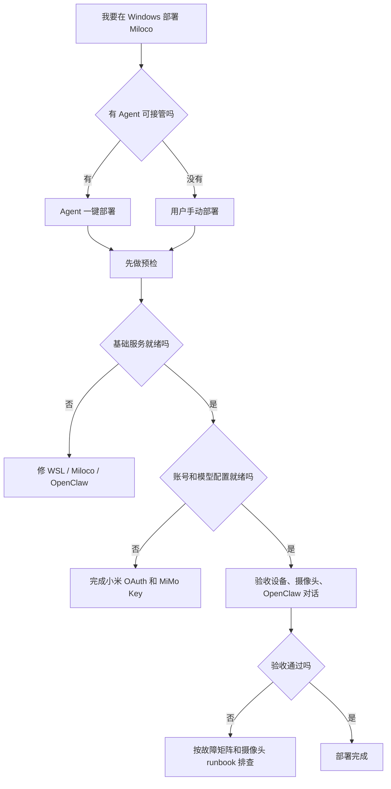

# Windows 部署总入口

用途：第一次在 Windows 电脑部署 Miloco 时，从这里开始。目标是先跑通基础服务，再完成小米账号、MiMo/Omni Key、设备和摄像头验收。

## 先选路径



## 入口文档

| 场景 | 文档 |
| --- | --- |
| Agent 全程代劳 | [agent-install.md](agent-install.md) |
| 用户自己一步步操作 | [manual-install.md](manual-install.md) |
| 不确定下一步 | [decision-tree.md](decision-tree.md) |
| 已经看到报错 | [troubleshooting.md](troubleshooting.md) |
| 摄像头离线/黑屏/Agent 看不到画面 | [camera-runbook.md](camera-runbook.md) |
| 发布给其他用户的一页式教程 | [standalone-package.md](standalone-package.md) |
| 预检与验收清单 | [preflight-checklist.md](preflight-checklist.md) |
| 满血验收证据 | [full-validation-evidence.md](full-validation-evidence.md) |

## 最短命令

如果已经拿到 release 包里的 `scripts/` 文件夹，在目标 Windows PowerShell 中先跑诊断：

```powershell
powershell.exe -ExecutionPolicy Bypass -File .\win-miloco-workflow.ps1 -Action Report -Distro Ubuntu-24.04 -MilocoPort 1886 -OpenClawPort 18789
```

如果只是想快速看基础状态：

```powershell
powershell.exe -ExecutionPolicy Bypass -File .\win-miloco-workflow.ps1 -Action AllBasic -Distro Ubuntu-24.04 -MilocoPort 1886 -OpenClawPort 18789
```

结果判断：

- `BASIC_READY_FROM_WINDOWS=yes`：Windows 宿主可以访问服务端口。
- `BASIC_READY=yes`：WSL 内 Miloco、OpenClaw、插件基础链路可用。
- `FULL_READY=yes`：账号、Key、设备、摄像头 scope 都可用。
- `FULL_READY=no`：不要重装，继续补账号、Key、设备或摄像头。

## 满血验收标准

交付前至少确认：

- `miloco-cli service status` 显示 `running=true`。
- `curl http://127.0.0.1:1886/health` 返回 `{"status":"ok"}`。
- `openclaw gateway status` 连通。
- `openclaw plugins inspect miloco-openclaw-plugin` 显示插件 loaded。
- `miloco-cli account status` 显示小米账号已绑定。
- `miloco-cli device list` 能列出设备。
- `miloco-cli scope camera list --pretty` 能列出目标摄像头。
- 摄像头按 [camera-runbook.md](camera-runbook.md) 逐个核对 `online`、`lan_online`、`connected`、`active_sources` 和 OpenClaw 视觉描述。

## WIN-home01 脱敏案例

WIN-home01 是本 fork v0.1 的第一台实机部署样本，已沉淀为脱敏案例：

- [win-home01-log.md](win-home01-log.md)
- [win-home01-readiness-audit.md](win-home01-readiness-audit.md)
- [win-home01-official-readme-validation.md](win-home01-official-readme-validation.md)
- [win-home01-post-auth-runbook.md](win-home01-post-auth-runbook.md)
- [validation-record.md](validation-record.md)
