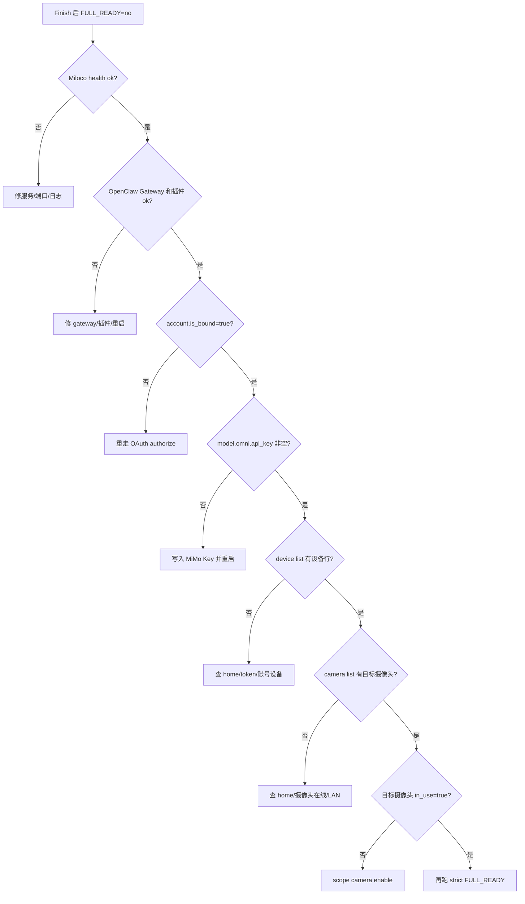

# Windows 后授权失败排障与交付审计

> 生成日期：2026-06-22
> 用途：收到小米 OAuth payload 和 MiMo API Key 后，如果 `Finish` 没有直接得到 `FULL_READY=yes`，按本页分层定位；同时作为最终交付前的审计清单。
> 关联：[WIN-home01后授权收尾Runbook](win-home01-post-auth-runbook.md)、[Windows部署故障排除矩阵](troubleshooting.md)、[Windows满血验收证据清单](full-validation-evidence.md)

## 官方流程锚点

本地仓库官方 installer 支持非交互收尾参数：

```bash
bash /tmp/miloco-install.sh --agent-finish \
  --account-auth '<小米 OAuth payload>' \
  --omni-api-key '<MiMo API Key>'
```

Windows/WSL 包装脚本 `win-miloco-workflow.ps1 -Action Finish` 与 `wsl-post-auth-finish.sh` 的目标是把同一套动作脚本化：

1. 执行 `miloco-cli account authorize`。
2. 写入 `model.omni.model`、`model.omni.base_url`、`model.omni.api_key`。
3. 重启 Miloco 和 OpenClaw Gateway。
4. 检查家庭、设备、摄像头。
5. 执行严格满血验收。

默认模型配置：

```text
model.omni.model=<视觉模型，例如 xiaomi/mimo-v2.5 或 mimo-v2.5>
model.omni.base_url=<Omni Base URL>
```

## 分层判断

`FULL_READY=no` 不是一个单一故障。先看它停在哪一层。



## 快速采证命令

在 WSL 内执行：

```bash
miloco-cli service status
curl -fsS http://127.0.0.1:<miloco_port>/health
openclaw gateway status
openclaw plugins inspect miloco-openclaw-plugin
openclaw plugins doctor
miloco-cli account status
miloco-cli config get model.omni.model --value-only
miloco-cli config get model.omni.base_url --value-only
miloco-cli config get model.omni.api_key --value-only
miloco-cli scope home list --pretty
miloco-cli device list
miloco-cli scope camera list --pretty
tail -n 120 ~/.openclaw/miloco/log/miloco-backend.log
```

## 失败分支

| 现象 | 判断 | 下一步 |
| --- | --- | --- |
| `account authorize` 失败 | payload 过期、复制不完整、服务未运行 | 重新 `account bind --no-wait`，用户重新登录复制 payload，再 `authorize --pretty` |
| `account.status is_bound=false` | 授权没有生效 | 不继续查设备；先修账号 |
| `model.omni.api_key` 为空 | Key 未写入或写入路径错 | `miloco-cli config set model.omni.model '<视觉模型>' model.omni.base_url '<Omni Base URL>' model.omni.api_key '<MiMo API Key>' --no-restart`，再重启 |
| 日志仍有 `access token is empty` | 小米 token 不可用 | 重走 OAuth，确认 `account status` |
| 日志仍有 `多模态大模型 API Key 未配置` | 模型 Key 没被运行时读取 | 复核 config，再 `miloco-cli service restart` |
| `device list` 只有表头 | 账号未绑定、home 错误、账号下无设备 | `scope home list --pretty`，必要时 `scope home switch '<home_id>'` |
| `scope camera list` 为空 | 无可访问摄像头、home 错误、摄像头离线或 LAN 不可达 | 先确认 `device list`，再查 home 和摄像头在线状态 |
| 目标摄像头 `in_use=false` | 未启用感知 | `miloco-cli scope camera enable --pretty '<did>'` |
| `connected=false` 或实时流异常 | 摄像头本地流不可达 | 检查 WSL mirrored、Hyper-V firewall、部署机器是否在摄像头本地网络 |
| OpenClaw 插件未加载 | gateway 没重启或插件注册异常 | `openclaw gateway restart`，再 `openclaw plugins inspect miloco-openclaw-plugin` |

## 交付审计

最终交付前必须能贴出这些证据：

```text
BASIC_READY_FROM_WINDOWS=yes
BASIC_READY=yes
FULL_READY=yes
```

并满足：

- `miloco-cli account status` 显示 `is_bound=true`。
- `miloco-cli config get model.omni.api_key --value-only` 非空。
- `miloco-cli device list` 表头后有设备行。
- `miloco-cli scope camera list --pretty` 能列出目标摄像头。
- 需要感知的摄像头 `in_use=true`。
- `openclaw plugins inspect miloco-openclaw-plugin` 为 `Status: loaded`。
- `openclaw plugins doctor` 无插件问题。
- 后端日志不再出现 `access token is empty` 或 `多模态大模型 API Key 未配置`。

如果只有基础链路通过，但账号、Key、设备或摄像头任一项缺失，只能交付为“基础部署完成，满血未完成”。
