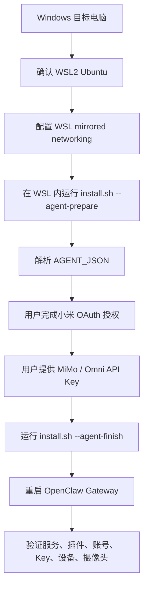

# 官方部署流程对齐核查

> 核查日期：2026-06-22，最新复核：04:57
> 对齐对象：Xiaomi Miloco 源码仓库 `README.zh.md`、`scripts/install-guide.md`、`scripts/install.sh`、`scripts/install.py`、`scripts/install.ps1`
> 关联：[Windows部署总入口](index.md)、[部署指南](deployment-guide.md)、[WIN-home01部署实录](win-home01-log.md)

## 结论

当前 OB Windows 部署教程和 WIN-home01 实机部署路径与官方主线一致：

- Windows 原生不安装 Miloco，只在 WSL 内安装和运行。
- 官方 release 安装入口仍是 `install.sh`，Agent 自动化入口是 `--agent-prepare` → 人工收集账号/模型信息 → `--agent-finish`。
- 账号授权和 MiMo / Omni API Key 不是可跳过的满血能力条件；跳过后只能算基础服务与插件就绪。
- WSL 摄像头本地流需要 mirrored networking 和 Hyper-V 防火墙入站放行。
- OpenClaw 插件安装后需要重启 OpenClaw Gateway。

WIN-home01 的差异属于 Windows/WSL 实机适配，不改变官方流程：

- 默认 `1810` 落入 Windows TCP excluded port range，所以改用 `1886`。
- WSL 内没有 Linux `node` 且不能免密 sudo，所以用用户目录安装 Node 后再装 OpenClaw。
- 国内网络使用显式 `http_proxy` / `https_proxy` / `all_proxy`，没有关闭 Clash Verge TUN。
- OB 中的 `win-miloco-workflow.ps1`、预检脚本和验收脚本是外层编排与证据采集，不替代官方 installer。

## 官方流程图



## 官方步骤对齐表

| 官方步骤 | 官方口径 | WIN-home01 实机处理 | 判断 |
| --- | --- | --- | --- |
| 操作系统 | README 写明 macOS / Linux，Windows 请在 WSL 中运行；`install.ps1` 直接提示原生 Windows 不支持 | 使用 Windows 用户 `17239` 名下的 `Ubuntu-24.04` WSL2 | 已对齐 |
| WSL 网络 | README 要求摄像头本地流启用 `networkingMode=mirrored`，并放行 Hyper-V 防火墙 | `.wslconfig` 已为 mirrored，Hyper-V VM firewall `DefaultInboundAction=Allow` | 已对齐 |
| 安装入口 | `curl -LsSf .../install.sh \| bash` | 下载到 `/tmp/miloco-install.sh` 后执行，便于重跑和观察 | 已对齐，执行形式更可控 |
| Agent Step 1 | `install.sh --agent-prepare` 做环境检查、安装包、初始化服务，并输出 `AGENT_JSON` | 已执行；期间 `uv tool install` 长时间下载，按缓存增长判断继续等待 | 已对齐 |
| Agent Step 2 | Agent 先处理账号授权，再处理 Omni 模型配置，禁止两个问题同时问 | 已先获取小米 OAuth payload，再写入 MiMo Key；`mimo-v2.5` 用于视觉，未误用不支持视觉的 `mimo-v2.5-pro` | 已完成 |
| Agent Step 3 | `install.sh --agent-finish --account-auth ... --omni-api-key ...` 写入账号/模型、下载模型、安装插件 | 已先不带授权信息执行一次完成基础模型和 OpenClaw 插件；收到 payload 后用收尾脚本补齐账号、模型、重启和最终验收 | 已完成 |
| OpenClaw 插件 | installer 安装 `miloco-openclaw-plugin`，并设置 tools / conversation access | 插件 `Status: loaded`，`allowConversationAccess=true`，`plugins doctor` 无问题 | 已对齐 |
| 快速开始 | README 要求配置模型、绑定小米账号、开启摄像头感知 | 模型已配置；账号已绑定；设备 127 行；摄像头 `<camera-did-desk> / 主卧 电脑桌上` 在线、启用、已连接 | 已满血 |
| 验收 | 官方常用命令包括 service status、logs、device list、config show；README 还要求 dashboard / doctor | OB 脚本额外区分 `BASIC_READY` 和 `FULL_READY` | 已增强，不偏离 |

## 适配项说明

### 1. 端口从 1810 改为 1886

官方默认面板地址是 `http://<host>:1810/`。WIN-home01 上 Windows TCP excluded port range 包含 `1786-1885`，默认 `1810` 绑定失败，后端日志出现：

```text
error while attempting to bind on address ('127.0.0.1', 1810): address already in use
```

因此本机改为：

```json
{
  "server": {
    "port": 1886,
    "url": "http://127.0.0.1:1886"
  }
}
```

这是 Windows/WSL mirrored 下的端口适配，不是 Miloco 官方默认值。

### 2. OpenClaw 和 Node 的安装方式

官方 installer 会安装 Miloco 的 OpenClaw 插件，但前提是目标环境可用 `openclaw`。WIN-home01 的 WSL 内没有 Linux `node`，且当前 WSL 用户不能免密 sudo，所以没有走 `apt`，而是把 Node 装到：

```text
/home/<wsl-user>/.local/opt/node-v24.12.0-linux-x64
```

并把 `node`、`npm`、`npx` 链到：

```text
/home/<wsl-user>/.local/bin
```

这是为了满足 OpenClaw CLI/Gateway 的运行前置条件。

### 3. 预检和验收脚本的定位

`02-deploy/scripts/` 下的脚本只做三类事情：

- Windows 宿主预检：WSL、端口排除、防火墙、代理、HTTP 可达。
- WSL 验收：Miloco health、OpenClaw Gateway、插件、账号、Key、设备、摄像头。
- 后授权收尾：收到 OAuth payload 和 MiMo API Key 后，执行账号授权、模型配置、重启和最终验收。

它们不替代官方 `install.sh`。干净机器仍优先从官方 `--agent-prepare` / `--agent-finish` 开始。

## 当前 WIN-home01 状态

已完成：

- `Ubuntu-24.04` WSL2 可用。
- Miloco 后端：`http://127.0.0.1:1886/health` 返回 `{"status":"ok"}`。
- OpenClaw Gateway：`http://127.0.0.1:18789/` running。
- `miloco-openclaw-plugin` 已 loaded。
- 诊断报告留档：`reports/WIN-home01-20260622-102255-full-ready.txt`。

已完成：

- `miloco-cli account status` 为 `is_bound=true`。
- `model.omni.model=mimo-v2.5`，`model.omni.base_url=https://token-plan-sgp.xiaomimimo.com/v1`，API Key 已配置。
- `miloco-cli device list` 返回 127 行设备。
- `miloco-cli scope camera list --pretty` 返回摄像头 `<camera-did-desk> / 主卧 电脑桌上`，`in_use=true`，`connected=true`。
- `FULL_READY=yes`。

10:22 复核结论：

```text
BASIC_READY=yes
FULL_READY=yes
WARN_COUNT=0
FAIL_COUNT=0
```

维护命令：

```powershell
powershell.exe -NoProfile -ExecutionPolicy Bypass -File C:\Users\<user>\AppData\Local\Temp\win-miloco-workflow.ps1 -Action Validate -Distro Ubuntu-24.04 -MilocoPort 1886 -OpenClawPort 18789
```

## 后续维护规则

- 如果官方 `scripts/install-guide.md` 新增参数，先更新 [Windows部署教程-Agent一键版](agent-install.md) 和 [Agent一键部署提示词](agent-prompt.md)。
- 如果官方 README 修改 Windows 支持状态，先更新 [部署指南](deployment-guide.md) 的支持环境，再更新所有 Windows 教程。
- 如果只是某台 Windows 机器的端口、代理、权限差异，追加到对应实录和 [Windows部署故障排除矩阵](troubleshooting.md)，不要写成官方默认步骤。
